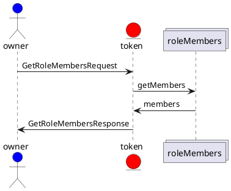
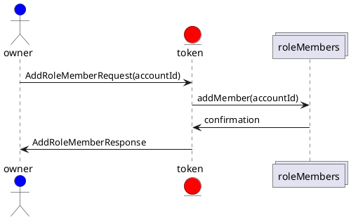
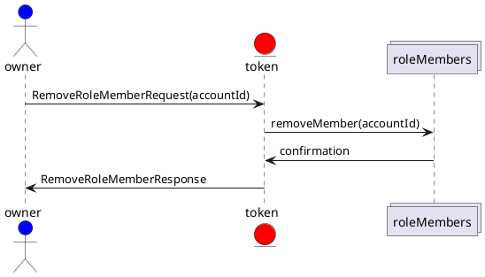
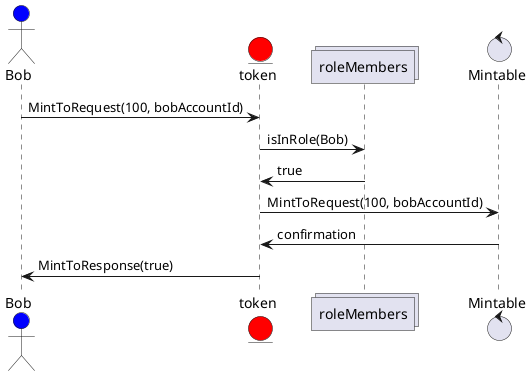
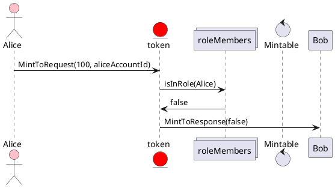

# Example sequence diagram for the TTF

Using standard, TBD, diagraming, complete token sequence diagrams can be composed from the TTF.

Assumptions:

- A role is defined in the token. i.e. Minters
- A behavior(s) is scoped to be allowed by members of the role. i.e. Mintable

## GetRoleMembers

## AddRoleMembers

## RemoveRoleMembers

## Role used during role scoped behavior

For example, here is how this would behave for a token that implements Mintable, has a role defined called Minters and has Bob as a member of the Minters role.  Bob is going to Mint 100 tokens to his account.

Alice is not in the role and  going to Mint 100 tokens to her account.

