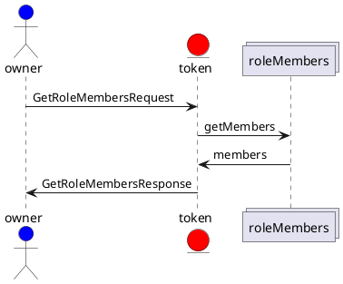
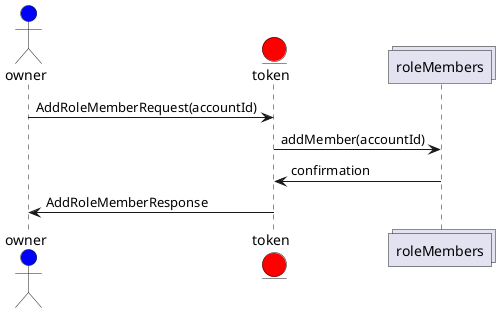
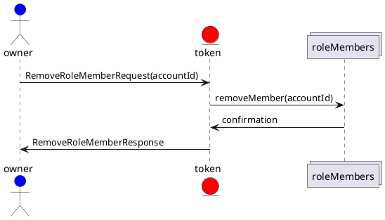

# Log Token Example Sequence Diagram

Using standard, TBD, diagraming, complete token sequence diagrams can be composed from the TTF.

Assumptions:

- A role is defined in the token. i.e. Viewers
- A behavior(s) is scoped to be allowed by members of the role. i.e. Viewer

## GetRoleMembers

## AddRoleMembers

## RemoveRoleMembers

