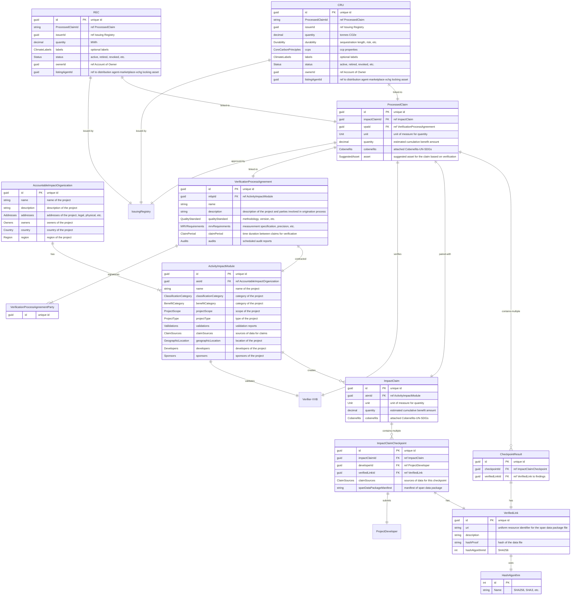

# DMRV Diagrams to support the specification

These are data type *highlights* and do not include all type properties, just the main ones.

Example assets, CRU and REC, are included in the diagrams to show how they are linked to their origination lineage.

