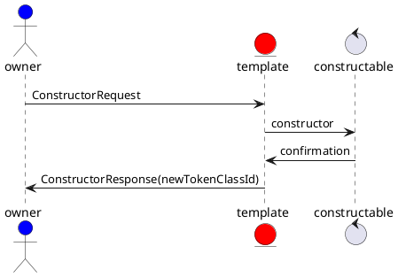
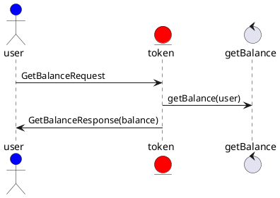

# Logical Interaction Model

This is a generic interaction model when using the concepts from the taxonomy to demonstrate how tokens are used.

## Token Create Class from Template sequence

## Token Class interaction

