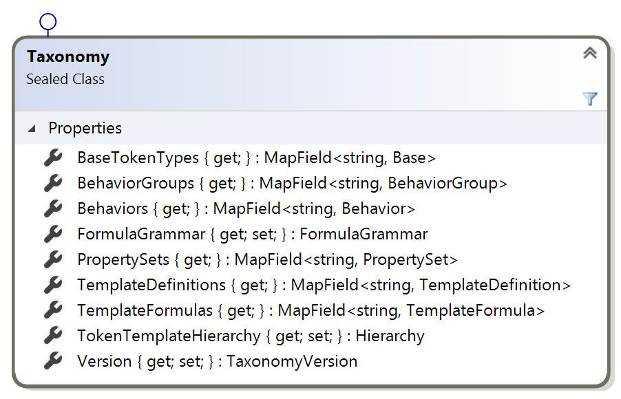
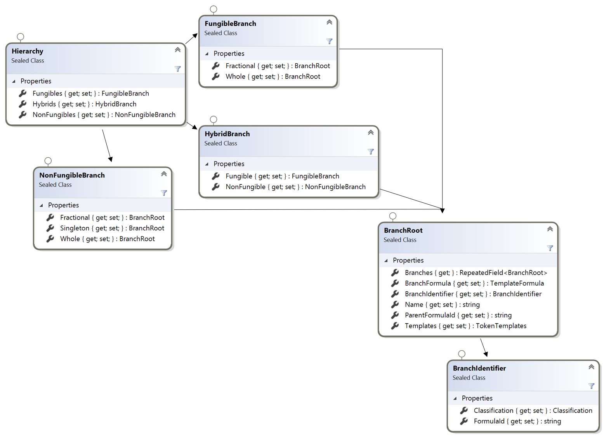
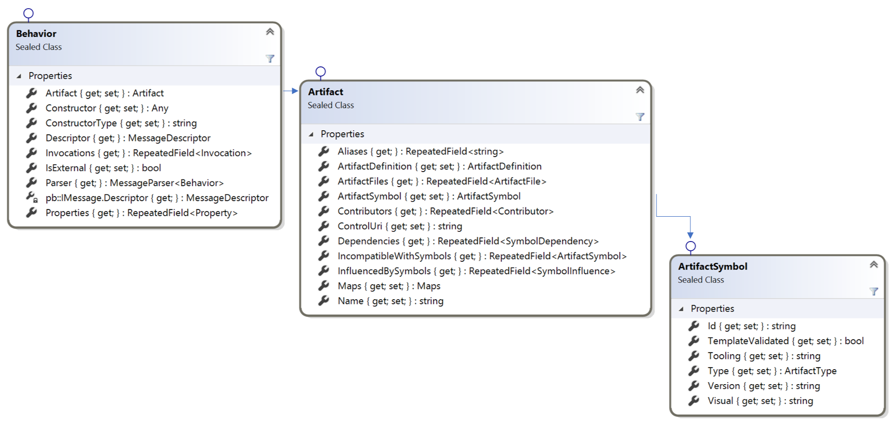
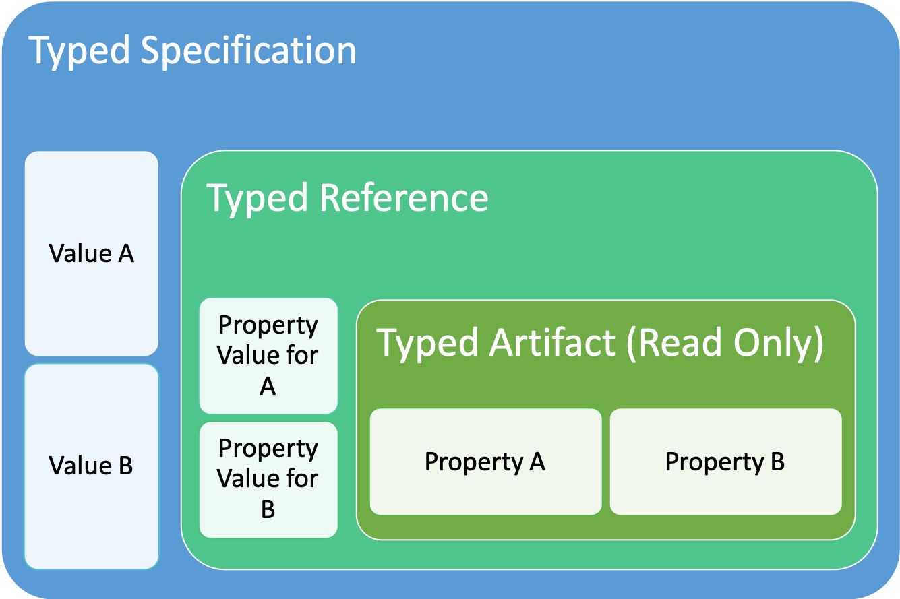

# Taxonomy Object Model (TOM) Guide

The TTF is comprised of artifacts that represent the components used to define a token template and specification. The TOM contains collections of TTF artifact types grouped together. There is a collection for Token Bases, Behaviors, Behavior Groups, Property Sets, Template Formulas and Template Definitions. The TOM also has a hierarchical layout of Token Templates and Specifications.

The TOM is persisted to the [artifacts](../artifacts) folder and is loaded, saved and provided by the [TaxonomyService](../tools/TaxonomyService) and should be the primary programmatic access to the TTF.

To understand how to obtain the TOM using a gRpc call and to create, update and delete artifacts, see [Taxonomy Services](taxomonyServices.md).

The TOM is defined in the [protos](protos) folder in a set of protocol buffer files that are compiled into libraries for popular platforms like .Net, Java, Go, TypeScript, etc. in the [TOM](../tools/TaxonomyObjectModel) folder. The `protoc` creates the libraries using the `build-model.sh` bash script.  Note, you may need to adjust the path to the `protoc` and `grpcPluggin` folders for your local install.

## Taxonomy

The Taxonomy Object is the parent or container object that holds all of the collections of artifacts. You can request from the Taxonomy Service to obtain the entire TOM or you can request specific artifacts using their unique identifiers or tooling symbols. Unless memory constrained or the TTF grows too large, it is recommended that the client request the full TOM and work with the the TOM locally sending individual artifacts to be updated back to the service to be persisted to the artifacts folder.

The Taxonomy is represented by a version, supporting potential side by side major versions of the TTF in the future.

## Taxonomy Object

The TOM root object is Taxonomy, which has a `TaxonomyVersion` property, key/value collections of artifacts by type, a Hierarchy of templates and a token formula grammar.



Above are the collections, represented in the native language, in this case C# as a MapField, with the artifact Id as the key string and the object of the collection type as the value.

## Taxonomy Hierarchy

The TOM, when it is retrieved from the [artifacts](../artifacts) folder will build a default hierarchy of token templates by their classification. This is a dynamic hierarchy that is not persisted and can be changed at runtime.

This is useful for user interfaces that want to represent a visual hierarchy. The hierarchy can be adjusted and rebuilt based on a user's input without connecting with the Taxonomy Service.



## Artifact Type Collections

Each artifact type is place within a collection where the key is the artifact Id and the value is the object of that type.


Any artifact can be fetched by their ArtifactId, using the key property, or looped through using the items collection.

## Artifact

Every Artifact has an Artifact property, which holds the common schema and data elements for the TTF. The Artifact property or object is the 1st property defined in the artifact type description.

```proto
message Behavior{
    taxonomy.model.artifact.Artifact artifact = 1;
    bool is_external = 2;
    ...
```

Each Artifact has an ArtifactSymbol that contains unique properties for the Artifact and it is the 1st property of every Artifact.

```proto
message Artifact {
    ArtifactSymbol artifact_symbol = 1;
    string name = 2;
    repeated string aliases = 3;
    ...
```

The ArtifactSymbol has a globally unique identifier, currently a GUID or UUID, for the artifact itself regardless of its type.  In the ArtifactSymbol other properties are defined to assist with visual tooling and formulas as well as human readable versioning fields. Only the Id itself MUST be unique, other fields may have conflicts at runtime like a ToolingSymbol but not cause the Artifact Object to be invalid.  

```proto
message ArtifactSymbol{
    string id = 1; //unique identifier GUID/UUID - should be generated when the artifact is created. Must be unique throughout the framework.
    ArtifactType type = 2;
    string visual = 3; //symbol for single artifact and formula for templates
    string tooling = 4; //symbol for single artifact and formula for templates
    string version = 5; //for visualization, not guaranteed to be accurate.
    bool template_validated = 6; //for templates only
}
```



## Navigation

The TOM contains many objects that are nested together in relationships. To support runtime navigation, child or hosted objects will have a placeholder for its runtime parent, to support automated or tooling navigation. The TaxonomyService will construct the artifact's objects and their relationships placing a reference to a child object's parent in a typed parameter in the child.

For example, the ArtifactSymbol is a child of the Artifact and will contain an artifact property that references its parent.

The references are optional and may not be constructed depending on how the object was fetched from the service.

## Artifact Types

There are 6 types of artifacts, called `Typed Artifacts` that are persisted in the TTF. They are:

- TokenBase: A base token type with some initial characteristics like Fungible or Non-Fungible and Subdivision.
- Behavior: A defined capability or restriction that a token could implement.
- BehaviorGroup: A commonly used together set of behaviors that can go together and need to be configured in context together.
- PropertySet: A non-behavior data property that a token will have.
- TemplateFormula: A list of ingredient artifacts that a token has. This is used to classify a token in a hierarchy and to generate a TemplateDefinition from.
- TemplateDefinition: A recipe for implementing to token. It is initially generated by a formula that lists each artifact as an ingredient. The definition then creates a `Typed Artifact Reference` where context specific values for behaviors and property-sets as well as token base values like decimals to subdivide by are set. The Template Definition is where all the artifacts come together and the definition completed. A Token Specification is generated from the TemplateDefinition, whose ArtifactId becomes the Token Specification Id.

Each `ArtifactType` has a common object or property called Artifact which is where the common meta data for the artifact is stored.  The `ArtifactType` object then has the type specific properties.  Some of these properties may have the same name as a property name in the `Artifact` metadata. The difference is that the type specific properties are for the artifact type in context with other artifacts in a definition. For example, the Base token type has an `Base.Name` and `Base.Symbol` as well as a `Base.Artifact.Name` and a `Base.Artifact.ArtifactSymbol`. The `Base.Name` is the name of the token class once deployed and will only have a value in a TemplateDefinition if a specific class name MUST be used for the token on the network. The `Base.Artifact.Name` is the name of the artifact in the TTF NOT its name as it would be deployed on a network. The same goes for the symbols.

## Objects to prevent data duplication

A Typed Artifact, like a Behavior, is essentially a read-only recipe. When it is used the Artifact itself is not modified, but a reference type to the artifact.

A TemplateFormula will use an Template Reference, i.e. TemplateBehavior or TemplatePropertySet of its type that contains the ArtifactSymbol reference of the artifact being used. It is only a pointer to the artifact and it does not specify values.

A TemplateDefinition uses Typed References, like a BehaviorReference or a PropertySetReference, where the values for the artifact referenced can be supplied without modifying the actual artifact itself.

A TokenSpecification uses a Typed Specification, like a BehaviorSpecification or PropertySetSpecification, that is dynamically generated from the Typed References in the TemplateDefinition. 

## Token Specification

A Token Specification is generated using a TemplateDefinition by merging the artifact referenced in the Typed Reference in the definition and merging the values with the Artifact referenced into a Typed Specification artifact like a BehaviorSpecification. Values set in the ArtifactReference become the values set in the specification.



## Working locally with the TOM

The TOM is designed for composition, specifically to design new token templates from the collections of artifact types. Existing artifacts can be edited simply by updating any of their properties, except for the Artifact.Id which should not be changed unless there is a conflict with another artifact in the TOM.

Updating the text value of any of the properties will only reside within your local TOM until it is submitted to the TaxonomyService for updating the underlying json maintained in the git repo. These updates are stored on your local git branch and can be pushed to the git repo and submitted using a pull request to be included in the TOM globally. This isolates any changes made to the TOM locally and those changes are tracked locally and remotely using git. So if any mistakes are made, the changes can be rolled back. Regular git `commit` will allow you to modify safely with incremental updates and rollbacks if needed.

### New Artifacts

You can create any new artifact simply by creating a new object instance of the type. Any new type should be assigned a `type.Artifact.ArtifactSymbol.Id` GUID/UUID before being committed or pulled and a unique Visual and Tooling symbol based on their type and a common name, see [taxonomy](../token-taxonomy.md) for details on names and symbols.

New artifacts can should be submitted to the TaxonomyService to be persisted to the artifacts repo to be saved periodically to prevent data loss in memory if the application creating the object becomes unresponsive.

## Single and Compound Artifacts

Single artifacts, TokenBase, Behavior and PropertySet, are the simplest artifacts and are not concerned with other artifacts, other than listing dependencies, incompatibilities and influences which are just ArtifactSymbol references indicating that a relationship with the other artifact exists.

Compound artifacts like BehaviorGroup, TemplateFormula and TemplateDefinition are more complex. Of these the TemplateFormula has the least detail, but many references.

## TemplateFormula

A TemplateFormula is a collection of artifact ingredients that are mixed together to provide the potential functionality of any definition based off of. It is primarily used to perform ingredient level validation ensuring that conflicting symbols are not allowed using the taxonomy rules. This prevents TemplateDefinitions based off the formula from introducing artifacts that are not listed in the TemplateFormula that would not be valid. 

Creating a new TemplateFormula is just like creating any other new artifact, giving it a unique Id and name, but your may wait until after design to determine the symbol as it is a compound formula. A TemplateFormula can be a Single or Hybrid token and for each token it defines a TemplateBase, a Base token type, then the individual artifacts from the collections of behaviors, groups and property sets. These are recorded in the template using ArtifactSymbol references, which do not have any detail about how the reference is used, just that it is an ingredient.

From this list of artifacts included, a `TemplateFormula.Artifact.ArtifactSymbol.Tooling` symbol and it corresponding Visual symbol can be built and validated using the [taxonomy rules](../token-taxonomy.md).

Submit the formula for persistance to the TaxonomyService before proceeding to defining a TemplateDefinition.

## TemplateDefinition

A TemplateDefinition must be created using a TemplateFormula. The TaxonomyService will create and initialized a TemplateDefinition when provided with the `TemplateFormula.Artifact.ArtifactSymbol.Id` source formula and return it to you as a TemplateDefinition object. The TaxonomyService builds the TemplateDefinition object from the references in the formula and the referenced artifact values and settings that can be altered in the TemplateDefinition.

Modify and add property values in the TemplateDefinition to complete the definition of the TokenTemplate that is used to create the TokenSpecification. This is the last part of the composition where specific token settings like decimal places, role names, influences and invocations can be customized for the specific token. The TemplateDefinition will preserve the parent TemplateFormula reference.

The `TemplateDefinition.Artifact.ArtifactSymbol.Id` is also the TokenSpecification id and the `TemplateDefinition.Artifact.Name` becomes the name for the TokenSpecification and Template.

Send the updated object to the TaxonomyService to persist it to local storage. You can then print the TokenSpecification from the TaxonomyPrinter using the `TemplateDefinition.Artifact.ArtifactSymbol.Id` as input and it will generate the openXML output for your specification to review. To update the specification, you must update and persist the TemplateDefinition. Updates to the openXML document will be overwritten when the definition is printed again.

# Taxonomy Object Model Documentation

## Table of Contents

- [IWA.TTF.Taxonomy.Model.Artifact](#artifact.proto)
    - [Artifact](#taxonomy.model.artifact.Artifact)
    - [ArtifactAnalogy](#taxonomy.model.artifact.ArtifactAnalogy)
    - [ArtifactDefinition](#taxonomy.model.artifact.ArtifactDefinition)
    - [ArtifactFile](#taxonomy.model.artifact.ArtifactFile)
    - [ArtifactReference](#taxonomy.model.artifact.ArtifactReference)
    - [ArtifactReferenceValues](#taxonomy.model.artifact.ArtifactReferenceValues)
    - [ArtifactSymbol](#taxonomy.model.artifact.ArtifactSymbol)
    - [BehaviorList](#taxonomy.model.artifact.BehaviorList)
    - [Classification](#taxonomy.model.artifact.Classification)
    - [CommitUpdatesRequest](#taxonomy.model.artifact.CommitUpdatesRequest)
    - [CommitUpdatesResponse](#taxonomy.model.artifact.CommitUpdatesResponse)
    - [ConfigurationRequest](#taxonomy.model.artifact.ConfigurationRequest)
    - [Contributor](#taxonomy.model.artifact.Contributor)
    - [DeleteArtifactRequest](#taxonomy.model.artifact.DeleteArtifactRequest)
    - [DeleteArtifactResponse](#taxonomy.model.artifact.DeleteArtifactResponse)
    - [FormulaGrammar](#taxonomy.model.artifact.FormulaGrammar)
    - [HybridTokenGrammar](#taxonomy.model.artifact.HybridTokenGrammar)
    - [HybridTokenWithHybridChildrenGrammar](#taxonomy.model.artifact.HybridTokenWithHybridChildrenGrammar)
    - [Identifier](#taxonomy.model.artifact.Identifier)
    - [InitializeNewArtifactRequest](#taxonomy.model.artifact.InitializeNewArtifactRequest)
    - [InitializeNewArtifactResponse](#taxonomy.model.artifact.InitializeNewArtifactResponse)
    - [IssuePullRequest](#taxonomy.model.artifact.IssuePullRequest)
    - [IssuePullResponse](#taxonomy.model.artifact.IssuePullResponse)
    - [MapReference](#taxonomy.model.artifact.MapReference)
    - [MapResourceReference](#taxonomy.model.artifact.MapResourceReference)
    - [Maps](#taxonomy.model.artifact.Maps)
    - [NewArtifactRequest](#taxonomy.model.artifact.NewArtifactRequest)
    - [NewArtifactResponse](#taxonomy.model.artifact.NewArtifactResponse)
    - [NewTemplateDefinition](#taxonomy.model.artifact.NewTemplateDefinition)
    - [PropertySetList](#taxonomy.model.artifact.PropertySetList)
    - [PropertySetListItem](#taxonomy.model.artifact.PropertySetListItem)
    - [QueryOptions](#taxonomy.model.artifact.QueryOptions)
    - [QueryResult](#taxonomy.model.artifact.QueryResult)
    - [ServiceConfiguration](#taxonomy.model.artifact.ServiceConfiguration)
    - [SingleTokenGrammar](#taxonomy.model.artifact.SingleTokenGrammar)
    - [SymbolDependency](#taxonomy.model.artifact.SymbolDependency)
    - [SymbolInfluence](#taxonomy.model.artifact.SymbolInfluence)
    - [TokenTemplateId](#taxonomy.model.artifact.TokenTemplateId)
    - [UpdateArtifactRequest](#taxonomy.model.artifact.UpdateArtifactRequest)
    - [UpdateArtifactResponse](#taxonomy.model.artifact.UpdateArtifactResponse)
  
    - [ArtifactContent](#taxonomy.model.artifact.ArtifactContent)
    - [ArtifactType](#taxonomy.model.artifact.ArtifactType)
    - [MappingType](#taxonomy.model.artifact.MappingType)
    - [RepresentationType](#taxonomy.model.artifact.RepresentationType)
    - [TargetPlatform](#taxonomy.model.artifact.TargetPlatform)
    - [TemplateType](#taxonomy.model.artifact.TemplateType)
    - [TokenType](#taxonomy.model.artifact.TokenType)
    - [TokenUnit](#taxonomy.model.artifact.TokenUnit)
    - [ValueType](#taxonomy.model.artifact.ValueType)
  

- [IWA.TTF.Taxonomy.Model.Core](#core.proto)
    - [Base](#taxonomy.model.core.Base)
    - [Base.TokenPropertiesEntry](#taxonomy.model.core.Base.TokenPropertiesEntry)
    - [BaseReference](#taxonomy.model.core.BaseReference)
    - [BaseReference.TokenPropertiesEntry](#taxonomy.model.core.BaseReference.TokenPropertiesEntry)
    - [Bases](#taxonomy.model.core.Bases)
    - [Behavior](#taxonomy.model.core.Behavior)
    - [BehaviorGroup](#taxonomy.model.core.BehaviorGroup)
    - [BehaviorGroup.BehaviorArtifactsEntry](#taxonomy.model.core.BehaviorGroup.BehaviorArtifactsEntry)
    - [BehaviorGroupReference](#taxonomy.model.core.BehaviorGroupReference)
    - [BehaviorGroupSpecification](#taxonomy.model.core.BehaviorGroupSpecification)
    - [BehaviorGroups](#taxonomy.model.core.BehaviorGroups)
    - [BehaviorReference](#taxonomy.model.core.BehaviorReference)
    - [BehaviorSpecification](#taxonomy.model.core.BehaviorSpecification)
    - [Behaviors](#taxonomy.model.core.Behaviors)
    - [InfluenceBinding](#taxonomy.model.core.InfluenceBinding)
    - [Invocation](#taxonomy.model.core.Invocation)
    - [InvocationBinding](#taxonomy.model.core.InvocationBinding)
    - [InvocationBinding.Influence](#taxonomy.model.core.InvocationBinding.Influence)
    - [InvocationBinding.InvocationStep](#taxonomy.model.core.InvocationBinding.InvocationStep)
    - [InvocationParameter](#taxonomy.model.core.InvocationParameter)
    - [InvocationRequest](#taxonomy.model.core.InvocationRequest)
    - [InvocationResponse](#taxonomy.model.core.InvocationResponse)
    - [Property](#taxonomy.model.core.Property)
    - [PropertySet](#taxonomy.model.core.PropertySet)
    - [PropertySetReference](#taxonomy.model.core.PropertySetReference)
    - [PropertySetSpecification](#taxonomy.model.core.PropertySetSpecification)
    - [PropertySets](#taxonomy.model.core.PropertySets)
    - [PropertySpecification](#taxonomy.model.core.PropertySpecification)
    - [TemplateBase](#taxonomy.model.core.TemplateBase)
    - [TemplateBehavior](#taxonomy.model.core.TemplateBehavior)
    - [TemplateBehaviorGroup](#taxonomy.model.core.TemplateBehaviorGroup)
    - [TemplateDefinition](#taxonomy.model.core.TemplateDefinition)
    - [TemplateDefinitions](#taxonomy.model.core.TemplateDefinitions)
    - [TemplateFormula](#taxonomy.model.core.TemplateFormula)
    - [TemplateFormulas](#taxonomy.model.core.TemplateFormulas)
    - [TemplatePropertySet](#taxonomy.model.core.TemplatePropertySet)
    - [TokenBase](#taxonomy.model.core.TokenBase)
    - [TokenBehavior](#taxonomy.model.core.TokenBehavior)
    - [TokenBehaviorGroup](#taxonomy.model.core.TokenBehaviorGroup)
    - [TokenPropertySet](#taxonomy.model.core.TokenPropertySet)
    - [TokenSpecification](#taxonomy.model.core.TokenSpecification)
    - [TokenTemplate](#taxonomy.model.core.TokenTemplate)
    - [TokenTemplates](#taxonomy.model.core.TokenTemplates)
    - [TokenTemplates.TemplateEntry](#taxonomy.model.core.TokenTemplates.TemplateEntry)
  
    - [InfluenceType](#taxonomy.model.core.InfluenceType)

  
- [IWA.TTF.Taxonomy.Model](#taxonomy.proto)
    - [BranchIdentifier](#taxonomy.model.BranchIdentifier)
    - [BranchRoot](#taxonomy.model.BranchRoot)
    - [FungibleBranch](#taxonomy.model.FungibleBranch)
    - [Hierarchy](#taxonomy.model.Hierarchy)
    - [HybridBranch](#taxonomy.model.HybridBranch)
    - [NonFungibleBranch](#taxonomy.model.NonFungibleBranch)
    - [Taxonomy](#taxonomy.model.Taxonomy)
    - [Taxonomy.BaseTokenTypesEntry](#taxonomy.model.Taxonomy.BaseTokenTypesEntry)
    - [Taxonomy.BehaviorGroupsEntry](#taxonomy.model.Taxonomy.BehaviorGroupsEntry)
    - [Taxonomy.BehaviorsEntry](#taxonomy.model.Taxonomy.BehaviorsEntry)
    - [Taxonomy.PropertySetsEntry](#taxonomy.model.Taxonomy.PropertySetsEntry)
    - [Taxonomy.TemplateDefinitionsEntry](#taxonomy.model.Taxonomy.TemplateDefinitionsEntry)
    - [Taxonomy.TemplateFormulasEntry](#taxonomy.model.Taxonomy.TemplateFormulasEntry)
    - [TaxonomyVersion](#taxonomy.model.TaxonomyVersion)
  
  

- [Scalar Value Types](#scalar-value-types)


<a name="artifact.proto"></a>
<p align="right"><a href="#top">Top</a></p>

## IWA.TTF.Taxonomy.Model.Artifact


<a name="taxonomy.model.artifact.Artifact"></a>

### Artifact
Contains artifact metadata structure


| Field | Type | Label | Description |
| ----- | ---- | ----- | ----------- |
| artifact_symbol | [ArtifactSymbol](#taxonomy.model.artifact.ArtifactSymbol) |  | Contains the unique identifier for the artifact. |
| name | [string](#string) |  | This is the display and folder name for the artifact |
| aliases | [string](#string) | repeated | List other names this artifact is know by in other industry contexts. |
| artifact_definition | [ArtifactDefinition](#taxonomy.model.artifact.ArtifactDefinition) |  | Descriptive meta data about the artifact |
| dependencies | [SymbolDependency](#taxonomy.model.artifact.SymbolDependency) | repeated | Typically used for a BehaviorGroups or Behaviors that have a dependency on other artifacts. |
| incompatible_with_symbols | [ArtifactSymbol](#taxonomy.model.artifact.ArtifactSymbol) | repeated | For behaviors that have opposites, or if the base token, behavior or property-sets with conflicts. |
| influenced_by_symbols | [SymbolInfluence](#taxonomy.model.artifact.SymbolInfluence) | repeated | List know influences for behaviors that are primarly influence behaviors. Like Roles or Delegable. |
| control_uri | [string](#string) |  | Optional source code uri used for codegen tools |
| artifact_files | [ArtifactFile](#taxonomy.model.artifact.ArtifactFile) | repeated | Includes proto, markdown or other files located in the artifact version folder. |
| maps | [Maps](#taxonomy.model.artifact.Maps) |  | Can be overriden by ArtifactReferenceValues loop through the files and read them in as bytes to produce a complete artifact object model instance. |
| contributors | [Contributor](#taxonomy.model.artifact.Contributor) | repeated | List of contributors to the artifact. |


<a name="taxonomy.model.artifact.ArtifactAnalogy"></a>

### ArtifactAnalogy
An analogy outside of blockchains and tokens of this artifact.


| Field | Type | Label | Description |
| ----- | ---- | ----- | ----------- |
| name | [string](#string) |  | Analogy name |
| description | [string](#string) |  | Descrive scenarios, etc. |
| artifact_definition | [ArtifactDefinition](#taxonomy.model.artifact.ArtifactDefinition) |  | Navigation to parent |


<a name="taxonomy.model.artifact.ArtifactDefinition"></a>

### ArtifactDefinition
The definition should contain non-technical descriptions of the artifact.


| Field | Type | Label | Description |
| ----- | ---- | ----- | ----------- |
| business_description | [string](#string) |  | A description of the business use case. |
| business_example | [string](#string) |  | Provide an existing real world example. |
| analogies | [ArtifactAnalogy](#taxonomy.model.artifact.ArtifactAnalogy) | repeated | Provide analogies to add to the understanding of the artifact. |
| comments | [string](#string) |  | Should contain contextual information, debates or nuanced information. |
| artifact | [Artifact](#taxonomy.model.artifact.Artifact) |  | Navigation to parent |


<a name="taxonomy.model.artifact.ArtifactFile"></a>

### ArtifactFile
Artifact Files are files other than the serialized json that can include protos, markdown, etc.


| Field | Type | Label | Description |
| ----- | ---- | ----- | ----------- |
| content | [ArtifactContent](#taxonomy.model.artifact.ArtifactContent) |  | Type of content in the file. |
| file_name | [string](#string) |  | File name |
| file_data | [bytes](#bytes) |  | An optional byte array of the file contents. |
| artifact | [Artifact](#taxonomy.model.artifact.Artifact) |  | Navigation to parent |


<a name="taxonomy.model.artifact.ArtifactReference"></a>

### ArtifactReference
A reference to another artifact, either TemplateBranch to TemplateBranch, or ArtifactInstance to Artifact.


| Field | Type | Label | Description |
| ----- | ---- | ----- | ----------- |
| id | [string](#string) |  | This is to another Artifact&#39;s ArtifactSymbol.Id |
| type | [ArtifactType](#taxonomy.model.artifact.ArtifactType) |  | ArtifactType |
| reference_notes | [string](#string) |  | Notes about the reference. |
| values | [ArtifactReferenceValues](#taxonomy.model.artifact.ArtifactReferenceValues) |  | Values for this reference |


<a name="taxonomy.model.artifact.ArtifactReferenceValues"></a>

### ArtifactReferenceValues
Reference or mapping metadata.


| Field | Type | Label | Description |
| ----- | ---- | ----- | ----------- |
| control_uri | [string](#string) |  | can be a URL, DID, etc. |
| artifact_files | [ArtifactFile](#taxonomy.model.artifact.ArtifactFile) | repeated | Collection of files in the artifact&#39;s folder that can be looped through the files and read them in as bytes to produce a complete artifact object model instance. |
| maps | [Maps](#taxonomy.model.artifact.Maps) |  | For optional navigation. |


<a name="taxonomy.model.artifact.ArtifactSymbol"></a>

### ArtifactSymbol
Applied to each artifact


| Field | Type | Label | Description |
| ----- | ---- | ----- | ----------- |
| id | [string](#string) |  | Unique identifier GUID/UUID - should be generated when the artifact is created. Must be unique throughout the framework. |
| type | [ArtifactType](#taxonomy.model.artifact.ArtifactType) |  | Artifact Type |
| visual | [string](#string) |  | Symbol for single artifact and formula for templates |
| tooling | [string](#string) |  | Symbol for single artifact and formula for templates |
| version | [string](#string) |  | For visualization, not guaranteed to be accurate. |
| template_validated | [bool](#bool) |  | For templates only |


<a name="taxonomy.model.artifact.BehaviorList"></a>

### BehaviorList
Grammar for behaviors


| Field | Type | Label | Description |
| ----- | ---- | ----- | ----------- |
| list_start | [string](#string) |  | &#34;{&#34; |
| behavior_tooling_symbols | [string](#string) | repeated | lowercase letters for individual behaviors, UPPERCASE for behaviorGroup |
| list_end | [string](#string) |  | &#34;}&#34; |


<a name="taxonomy.model.artifact.Classification"></a>

### Classification
Classification uses these variable settings at runtime to determine what classification a token template or specification is in. These values are pulled from the TemplateFormula and TemplateDefintion.BaseToken


| Field | Type | Label | Description |
| ----- | ---- | ----- | ----------- |
| template_type | [TemplateType](#taxonomy.model.artifact.TemplateType) |  |  |
| token_type | [TokenType](#taxonomy.model.artifact.TokenType) |  |  |
| token_unit | [TokenUnit](#taxonomy.model.artifact.TokenUnit) |  |  |
| representation_type | [RepresentationType](#taxonomy.model.artifact.RepresentationType) |  |  |
| value_type | [ValueType](#taxonomy.model.artifact.ValueType) |  |  |


<a name="taxonomy.model.artifact.CommitUpdatesRequest"></a>

### CommitUpdatesRequest
Command for issuing a Commit on the local git.


| Field | Type | Label | Description |
| ----- | ---- | ----- | ----------- |
| commit_message | [string](#string) |  | Message for the commit. |


<a name="taxonomy.model.artifact.CommitUpdatesResponse"></a>

### CommitUpdatesResponse
Expected response from the commit request.


| Field | Type | Label | Description |
| ----- | ---- | ----- | ----------- |
| result | [string](#string) |  | Output of the commit request. |


<a name="taxonomy.model.artifact.ConfigurationRequest"></a>

### ConfigurationRequest
Command to retrieve the Service configuration.


<a name="taxonomy.model.artifact.Contributor"></a>

### Contributor
Artifact Contributor.


| Field | Type | Label | Description |
| ----- | ---- | ----- | ----------- |
| name | [string](#string) |  | Person&#39;s name |
| organization | [string](#string) |  | Member organization |


<a name="taxonomy.model.artifact.DeleteArtifactRequest"></a>

### DeleteArtifactRequest
Command to delete an artifact.


| Field | Type | Label | Description |
| ----- | ---- | ----- | ----------- |
| artifact_symbol | [ArtifactSymbol](#taxonomy.model.artifact.ArtifactSymbol) |  | Include the ArtifactSymbol.Id property value to indicate what artifact to delete. |


<a name="taxonomy.model.artifact.DeleteArtifactResponse"></a>

### DeleteArtifactResponse
Expected response from the DeleteArtifactRequest.


| Field | Type | Label | Description |
| ----- | ---- | ----- | ----------- |
| deleted | [bool](#bool) |  | Successful deletion indicator. |


<a name="taxonomy.model.artifact.FormulaGrammar"></a>

### FormulaGrammar
Object representation of a TemplateFormula&#39;s grammar.


| Field | Type | Label | Description |
| ----- | ---- | ----- | ----------- |
| single_token_grammar | [SingleTokenGrammar](#taxonomy.model.artifact.SingleTokenGrammar) |  | Grammar for single token templates. |
| hybrid_grammar | [HybridTokenGrammar](#taxonomy.model.artifact.HybridTokenGrammar) |  | Grammar for hybrid token templates. |
| hybrid_with_hybrids_grammar | [HybridTokenWithHybridChildrenGrammar](#taxonomy.model.artifact.HybridTokenWithHybridChildrenGrammar) |  | Grammar for nested hybrids. |


<a name="taxonomy.model.artifact.HybridTokenGrammar"></a>

### HybridTokenGrammar
Hybrid Token Grammar


| Field | Type | Label | Description |
| ----- | ---- | ----- | ----------- |
| parent | [SingleTokenGrammar](#taxonomy.model.artifact.SingleTokenGrammar) |  | Parent token |
| children_start | [string](#string) |  | &#34;(&#34; |
| child_tokens | [SingleTokenGrammar](#taxonomy.model.artifact.SingleTokenGrammar) | repeated | Collection of child tokens. |
| children_end | [string](#string) |  | &#34;)&#34; |


<a name="taxonomy.model.artifact.HybridTokenWithHybridChildrenGrammar"></a>

### HybridTokenWithHybridChildrenGrammar
Nested Hybrid grammar


| Field | Type | Label | Description |
| ----- | ---- | ----- | ----------- |
| parent | [SingleTokenGrammar](#taxonomy.model.artifact.SingleTokenGrammar) |  | Parent token |
| hybrid_children_start | [string](#string) |  | &#34;(&#34; |
| hybrid_child_tokens | [HybridTokenGrammar](#taxonomy.model.artifact.HybridTokenGrammar) | repeated | Collection of child tokens. |
| hybrid_children_end | [string](#string) |  | &#34;)&#34; |


<a name="taxonomy.model.artifact.Identifier"></a>

### Identifier
Generic argument for fetching an artifact by its ArtifactSymbol.Id


| Field | Type | Label | Description |
| ----- | ---- | ----- | ----------- |
| id | [string](#string) |  | Artifact Id |


<a name="taxonomy.model.artifact.InitializeNewArtifactRequest"></a>

### InitializeNewArtifactRequest
Initialize a new artifact.


| Field | Type | Label | Description |
| ----- | ---- | ----- | ----------- |
| artifact_type | [ArtifactType](#taxonomy.model.artifact.ArtifactType) |  | New artifact type |
| name | [string](#string) |  | New Artifact Name |
| symbol | [string](#string) |  | Value Ignored if a TemplateFormula |
| template_type | [TemplateType](#taxonomy.model.artifact.TemplateType) |  | Value Ignored if not a TemplateFormula |
| token_type | [TokenType](#taxonomy.model.artifact.TokenType) |  | Value Ignored if not a TemplateFormula |
| token_unit | [TokenUnit](#taxonomy.model.artifact.TokenUnit) |  | Value Ignored if not a TemplateFormula |


<a name="taxonomy.model.artifact.InitializeNewArtifactResponse"></a>

### InitializeNewArtifactResponse
Response expected from a InitializeNewArtifactRequest.


| Field | Type | Label | Description |
| ----- | ---- | ----- | ----------- |
| artifact_type | [ArtifactType](#taxonomy.model.artifact.ArtifactType) |  | ArtifactType contained in the artifact property. |
| artifact | [google.protobuf.Any](#google.protobuf.Any) |  | Unpack this as the ArtifactType indicated. |


<a name="taxonomy.model.artifact.IssuePullRequest"></a>

### IssuePullRequest
Command to create a pull request


<a name="taxonomy.model.artifact.IssuePullResponse"></a>

### IssuePullResponse
Expected response from the PullRequest


| Field | Type | Label | Description |
| ----- | ---- | ----- | ----------- |
| response | [string](#string) |  | Output of the pull request. |


<a name="taxonomy.model.artifact.MapReference"></a>

### MapReference
Data for a Mapping


| Field | Type | Label | Description |
| ----- | ---- | ----- | ----------- |
| mapping_type | [MappingType](#taxonomy.model.artifact.MappingType) |  | Mapping Type |
| name | [string](#string) |  | Name of the mapping, can include a description. |
| platform | [TargetPlatform](#taxonomy.model.artifact.TargetPlatform) |  | Targeted Platform |
| reference_path | [string](#string) |  | Path, URL, DiD, etc. |
| maps | [Maps](#taxonomy.model.artifact.Maps) |  | Navigation to parent |


<a name="taxonomy.model.artifact.MapResourceReference"></a>

### MapResourceReference
A reference to external an resource.


| Field | Type | Label | Description |
| ----- | ---- | ----- | ----------- |
| mapping_type | [MappingType](#taxonomy.model.artifact.MappingType) |  | Type of mapping |
| name | [string](#string) |  | Name of the reference. |
| description | [string](#string) |  | Description of the reference, can be helpful if there are many references. |
| resource_path | [string](#string) |  | Path, URL, DiD, etc. |
| maps | [Maps](#taxonomy.model.artifact.Maps) |  | Navigation to parent |


<a name="taxonomy.model.artifact.Maps"></a>

### Maps
Maps are references for an artifact.


| Field | Type | Label | Description |
| ----- | ---- | ----- | ----------- |
| code_references | [MapReference](#taxonomy.model.artifact.MapReference) | repeated | References to code. |
| implementation_references | [MapReference](#taxonomy.model.artifact.MapReference) | repeated | References to implementations or solutions. |
| resources | [MapResourceReference](#taxonomy.model.artifact.MapResourceReference) | repeated | Reference to external frameworks, legal guidance, etc. |
| artifact | [Artifact](#taxonomy.model.artifact.Artifact) |  | Navigation to parent |


<a name="taxonomy.model.artifact.NewArtifactRequest"></a>

### NewArtifactRequest
These is a command message that is used to communicate with the Taxonomy Service to submit a newly created object to be persisted.


| Field | Type | Label | Description |
| ----- | ---- | ----- | ----------- |
| type | [ArtifactType](#taxonomy.model.artifact.ArtifactType) |  | ArtifactType contained in the artifact property. |
| artifact | [google.protobuf.Any](#google.protobuf.Any) |  | An Any Packed artifact that will be Unpacked as the ArtifactType on the Service side. |


<a name="taxonomy.model.artifact.NewArtifactResponse"></a>

### NewArtifactResponse
Expected Response from the NewArtifactRequest


| Field | Type | Label | Description |
| ----- | ---- | ----- | ----------- |
| type | [ArtifactType](#taxonomy.model.artifact.ArtifactType) |  | What ArtifactType is contained in the ArtifactTypeObject property. |
| artifact_type_object | [google.protobuf.Any](#google.protobuf.Any) |  | Unpack this based on ArtifactType |


<a name="taxonomy.model.artifact.NewTemplateDefinition"></a>

### NewTemplateDefinition
Command to create a new TemplateDefinition from a TemplateFormula Id.


| Field | Type | Label | Description |
| ----- | ---- | ----- | ----------- |
| template_formula_id | [string](#string) |  | TemplateFormula Id to create the definition from. |
| token_name | [string](#string) |  | Name of the TemplateDefinition, this will be the Definition and Specification Name. |


<a name="taxonomy.model.artifact.PropertySetList"></a>

### PropertySetList
Grammar for property sets


| Field | Type | Label | Description |
| ----- | ---- | ----- | ----------- |
| list_start | [string](#string) |  | &#34;&#43;&#34; |
| property_sets | [PropertySetListItem](#taxonomy.model.artifact.PropertySetListItem) | repeated | model builder should put a comma between multiple sets. |


<a name="taxonomy.model.artifact.PropertySetListItem"></a>

### PropertySetListItem


| Field | Type | Label | Description |
| ----- | ---- | ----- | ----------- |
| property_set_symbol | [string](#string) |  | starts with ph followed by Camel case name or symbol. |


<a name="taxonomy.model.artifact.QueryOptions"></a>

### QueryOptions
Query options are used to issue generic query instructions.


| Field | Type | Label | Description |
| ----- | ---- | ----- | ----------- |
| artifact_type | [ArtifactType](#taxonomy.model.artifact.ArtifactType) |  | Query for artifact of this type. |
| max_item_return | [int32](#int32) |  | If there are many expected returns, limit return window to this number and enable paging. |
| last_item_index | [int32](#int32) |  | Set to the QuertResult.LastItemIndex from the previous QueryResult. Manually override from QueryResult FirstItemIndex &#43; count in results array |
| by_classification | [bool](#bool) |  | If true, the TemplateClassification value will apply, if false, it will search all templates. |
| classification | [Classification](#taxonomy.model.artifact.Classification) |  | Only if quering templates |
| include_hybrids | [bool](#bool) |  | Only if quering templates |


<a name="taxonomy.model.artifact.QueryResult"></a>

### QueryResult
Expected results from a Query


| Field | Type | Label | Description |
| ----- | ---- | ----- | ----------- |
| artifact_type | [ArtifactType](#taxonomy.model.artifact.ArtifactType) |  | ArtifactType returned. |
| first_item_index | [int32](#int32) |  | If paging through artifacts of type |
| last_item_index | [int32](#int32) |  | If paging, this is the &#43;1 for the next page. |
| total_items_in_collection | [int32](#int32) |  | Total count in the collection if iterating through all the items on the service of the specified type. |
| artifact_collection | [google.protobuf.Any](#google.protobuf.Any) |  | Deserialize to the collection object for the ArtifactType, i.e. Base will be a Bases, Behavior will be Behaviors, etc. |


<a name="taxonomy.model.artifact.ServiceConfiguration"></a>

### ServiceConfiguration
Expected output from the ConfigurationRequest.


| Field | Type | Label | Description |
| ----- | ---- | ----- | ----------- |
| read_only | [bool](#bool) |  |  |
| git_id | [string](#string) |  |  |
| git_branch | [string](#string) |  |  |


<a name="taxonomy.model.artifact.SingleTokenGrammar"></a>

### SingleTokenGrammar
Outermost grouping container for the formula for a whole template either a parent or hybrid child.


| Field | Type | Label | Description |
| ----- | ---- | ----- | ----------- |
| group_start | [string](#string) |  | &#34;[&#34; |
| base_token_tooling_symbol | [string](#string) |  |  |
| behaviors | [BehaviorList](#taxonomy.model.artifact.BehaviorList) |  |  |
| property_sets | [PropertySetList](#taxonomy.model.artifact.PropertySetList) |  |  |
| group_end | [string](#string) |  | &#34;]&#34; |


<a name="taxonomy.model.artifact.SymbolDependency"></a>

### SymbolDependency
An artifact may have a dependency, if listed it will be validated and included in compositions.


| Field | Type | Label | Description |
| ----- | ---- | ----- | ----------- |
| description | [string](#string) |  | Describe how the symbol influences this artifact, like non-divisible or delegable. |
| symbol | [ArtifactSymbol](#taxonomy.model.artifact.ArtifactSymbol) |  | Symbol of the dependency. |


<a name="taxonomy.model.artifact.SymbolInfluence"></a>

### SymbolInfluence
Reference to influencing artifact


| Field | Type | Label | Description |
| ----- | ---- | ----- | ----------- |
| description | [string](#string) |  | Describe how the symbol influences this artifact, like non-divisible or delegable. |
| symbol | [ArtifactSymbol](#taxonomy.model.artifact.ArtifactSymbol) |  | The ArtifactSymbol of the influencer. |
| applies_to | [ArtifactSymbol](#taxonomy.model.artifact.ArtifactSymbol) | repeated | List of behaviors or property-sets that are influenced by this symbol. |


<a name="taxonomy.model.artifact.TokenTemplateId"></a>

### TokenTemplateId
Used to query for a TemplateDefinition and to Build the TemplateSpecification


| Field | Type | Label | Description |
| ----- | ---- | ----- | ----------- |
| definition_id | [string](#string) |  | TemplateDefinition.Artifact.ArtifactSymbol.Id |


<a name="taxonomy.model.artifact.UpdateArtifactRequest"></a>

### UpdateArtifactRequest
These is a command message that is used to communicate with the Taxonomy Service to submit an update to an existing object to be persisted.


| Field | Type | Label | Description |
| ----- | ---- | ----- | ----------- |
| type | [ArtifactType](#taxonomy.model.artifact.ArtifactType) |  | The ArtifactType packed into the ArtifactTypeObject |
| artifact_type_object | [google.protobuf.Any](#google.protobuf.Any) |  | Unpack from Any to this type. |


<a name="taxonomy.model.artifact.UpdateArtifactResponse"></a>

### UpdateArtifactResponse
Expected Response from the UpdateArtifactRequest


| Field | Type | Label | Description |
| ----- | ---- | ----- | ----------- |
| type | [ArtifactType](#taxonomy.model.artifact.ArtifactType) |  | The ArtifactType packed into the ArtifactTypeObject |
| updated | [bool](#bool) |  | Successfuly updated the artifact. |
| artifact_type_object | [google.protobuf.Any](#google.protobuf.Any) |  | Unpack this based on ArtifactType |


 


<a name="taxonomy.model.artifact.ArtifactContent"></a>

### ArtifactContent
Content type for included files in the artifact&#39;s folder.

| Name | Number | Description |
| ---- | ------ | ----------- |
| DEFINITION | 0 | json serialized from proto |
| CONTROL | 1 | proto source |
| UML | 2 | md or other host UML |
| OTHER | 3 | any, pptx, docx, pdf |


<a name="taxonomy.model.artifact.ArtifactType"></a>

### ArtifactType
Available ArtifactTypes

| Name | Number | Description |
| ---- | ------ | ----------- |
| BASE | 0 |  |
| BEHAVIOR | 1 |  |
| BEHAVIOR_GROUP | 2 |  |
| PROPERTY_SET | 3 |  |
| TEMPLATE_FORMULA | 4 |  |
| TEMPLATE_DEFINITION | 5 |  |
| TOKEN_TEMPLATE | 6 |  |


<a name="taxonomy.model.artifact.MappingType"></a>

### MappingType
A reference or mapping type to an extension.

| Name | Number | Description |
| ---- | ------ | ----------- |
| SOURCE_CODE | 0 | Source code for the artifact. |
| IMPLEMENTATION | 1 | Finish implementation or solution of the token specification. |
| RESOURCE | 2 | To an external informational source like a regulatory framework or related issue |


<a name="taxonomy.model.artifact.RepresentationType"></a>

### RepresentationType
Tokens can have either a common representation, sometimes called account or balance tokens, or unique representation, or UTXO (unspent transaction output). This distinction might seem subtle but is important when considering how tokens can be traced and if they can have isolated and unique properties.

| Name | Number | Description |
| ---- | ------ | ----------- |
| COMMON | 0 | account or balance, non-fungible are always common |
| UNIQUE | 1 | UTXO |


<a name="taxonomy.model.artifact.TargetPlatform"></a>

### TargetPlatform
Target Platforms at the time of launch.

| Name | Number | Description |
| ---- | ------ | ----------- |
| ETHEREUM_SOLIDITY | 0 |  |
| CHAINCODE_GO | 1 |  |
| CHAINCODE_JAVA | 2 |  |
| CHAINCODE_NODE | 3 |  |
| CORDA | 4 |  |
| DAML | 5 |  |
| OTHER_PLATFORM | 6 | Instead of adding to this list, this can catch all lanugages and platforms not present at launch. |


<a name="taxonomy.model.artifact.TemplateType"></a>

### TemplateType
Token Templates can contain a single token definition or a hybrid, where the are nested tokens within the template.

| Name | Number | Description |
| ---- | ------ | ----------- |
| SINGLE_TOKEN | 0 |  |
| HYBRID | 1 |  |


<a name="taxonomy.model.artifact.TokenType"></a>

### TokenType
Fungible or Non-Fungible Token Base

| Name | Number | Description |
| ---- | ------ | ----------- |
| FUNGIBLE | 0 |  |
| NON_FUNGIBLE | 1 |  |


<a name="taxonomy.model.artifact.TokenUnit"></a>

### TokenUnit
Fractional, Whole or Singleton indicates if a token can be divided into smaller fractions, usually represented as decimals, or if there can be a quantity greater than 1. For example, a 1 dollar bill can sub-divided to 2 decimal places and can be broken into four .25 cent coins, or a number of different variation of coins, and is thus Fractional. Whole means no subdivision allowed, just whole numbers quantities, and a Singleton has a quantity of 1 with no subdivision.

| Name | Number | Description |
| ---- | ------ | ----------- |
| FRACTIONAL | 0 | Supports subdivision |
| WHOLE | 1 | Not divisible |
| SINGLETON | 2 | Not divisible and quantity of 1 |


<a name="taxonomy.model.artifact.ValueType"></a>

### ValueType
Intrinsic or Reference indicates if the token itself is a value, like a crypto currency, or if it references a value elsewhere, like a property title.

| Name | Number | Description |
| ---- | ------ | ----------- |
| INTRINSIC | 0 | pure digital |
| REFERENCE | 1 | digital representation of value elsewhere |


 

 

 


<a name="core.proto"></a>
<p align="right"><a href="#top">Top</a></p>

## IWA.TTF.Taxonomy.Model.Core


<a name="taxonomy.model.core.Base"></a>

### Base
All tokens inherit from the base and implicitly support construction. The properties represent non-behavioral properties, with the exception of Decimals which is used by the Subdividable or Non-Subdividable behavior where any value greater than 0 makes the token dividable.


| Field | Type | Label | Description |
| ----- | ---- | ----- | ----------- |
| artifact | [taxonomy.model.artifact.Artifact](#taxonomy.model.artifact.Artifact) |  | Artifact metadata |
| token_type | [taxonomy.model.artifact.TokenType](#taxonomy.model.artifact.TokenType) |  | Token Type |
| token_unit | [taxonomy.model.artifact.TokenUnit](#taxonomy.model.artifact.TokenUnit) |  | Token Unit |
| representation_type | [taxonomy.model.artifact.RepresentationType](#taxonomy.model.artifact.RepresentationType) |  | Representation Type |
| value_type | [taxonomy.model.artifact.ValueType](#taxonomy.model.artifact.ValueType) |  | Override this from the default of Intrinsic in the BaseReference for a TemplateDefinition to Reference type if needed. |
| name | [string](#string) |  | This is a deployment value that is a common, well understood name that represents the Token Class. All instances, or tokens, within this class will be referred to by their class name. |
| symbol | [string](#string) |  | This is a optional deployment value which is a unique symbol or identifier, not all tokens will have a symbol |
| owner | [string](#string) |  | This is a deployemnt value with a reference to the owner of the token class or instance which can be a blockchain address, public key or other unique identifier. |
| quantity | [int64](#int64) |  | This is a deployemnt value, Base64 encoded ByteString - can represent the initial quantity created or the total minted or issued for the class. |
| decimals | [int32](#int32) |  | This is a deployemnt value, a number of decimal places a single token can be divided into. A typical fiat currency has a value of 2, i.e. $100.53. A value of 0 means that subdivision is not supported and a whole token is the smallest unit of the token that can be owned. |
| token_properties | [Base.TokenPropertiesEntry](#taxonomy.model.core.Base.TokenPropertiesEntry) | repeated | This is a deployemnt value, contains generic non-behavioral properties as a list of simple `name, value` pairs that can be implemented without property invocations for each. |
| constructor_name | [string](#string) |  | A template must have a constructor, the name is the proto3 message name in the implemented token base definition. The default is Constructor. |
| constructor | [google.protobuf.Any](#google.protobuf.Any) |  | The constructor type defined in the token template artifact. |


<a name="taxonomy.model.core.Base.TokenPropertiesEntry"></a>

### Base.TokenPropertiesEntry


| Field | Type | Label | Description |
| ----- | ---- | ----- | ----------- |
| key | [string](#string) |  |  |
| value | [string](#string) |  |  |


<a name="taxonomy.model.core.BaseReference"></a>

### BaseReference
A Reference is used in the TemplateDefinition to provide property values to those defined in the base referenced. Any values set in a BaseReference is merged into the token specification when generated.


| Field | Type | Label | Description |
| ----- | ---- | ----- | ----------- |
| reference | [taxonomy.model.artifact.ArtifactReference](#taxonomy.model.artifact.ArtifactReference) |  | Artifact Reference |
| value_type | [taxonomy.model.artifact.ValueType](#taxonomy.model.artifact.ValueType) |  | Set this to change from the default of intrinsic if it is a reference value token. |
| name | [string](#string) |  | A common well understood name that represents the Token Class. All instances, or tokens, within this class will be referred to by their class name. |
| symbol | [string](#string) |  | An optionally unique symbol or identifier |
| owner | [string](#string) |  | A reference to the owner of the token class or instance which can be a blockchain address, public key or other unique identifier. |
| quantity | [int64](#int64) |  | Can represent the initial quantity created or the total minted or issued for the class. |
| decimals | [int32](#int32) |  | A number of decimal places a single token can be divided into. A typical fiat currency has a value of 2, i.e. $100.53. A value of 0 means that subdivision is not supported and a whole token is the smallest unit of the token that can be owned. |
| token_properties | [BaseReference.TokenPropertiesEntry](#taxonomy.model.core.BaseReference.TokenPropertiesEntry) | repeated | Generic non-behavioral properties as a list of simple `name, value` pairs that can be implemented without property invocations for each. |
| constructor_name | [string](#string) |  | A template must have a constructor, the name is the proto3 message name in the implemented token base definition. The default is Constructor. |
| constructor | [google.protobuf.Any](#google.protobuf.Any) |  | The constructor type defined in the token template artifact. |


<a name="taxonomy.model.core.BaseReference.TokenPropertiesEntry"></a>

### BaseReference.TokenPropertiesEntry


| Field | Type | Label | Description |
| ----- | ---- | ----- | ----------- |
| key | [string](#string) |  |  |
| value | [string](#string) |  |  |


<a name="taxonomy.model.core.Bases"></a>

### Bases
Collection of base token types


| Field | Type | Label | Description |
| ----- | ---- | ----- | ----------- |
| base | [Base](#taxonomy.model.core.Base) | repeated |  |


<a name="taxonomy.model.core.Behavior"></a>

### Behavior
Behavior artifact type


| Field | Type | Label | Description |
| ----- | ---- | ----- | ----------- |
| artifact | [taxonomy.model.artifact.Artifact](#taxonomy.model.artifact.Artifact) |  | Artifact metadata |
| is_external | [bool](#bool) |  | Indicator if this behavior is available or internal only. |
| constructor_type | [string](#string) |  | Proto message name empty if there is no constructor, used when unpacking the Any. |
| constructor | [google.protobuf.Any](#google.protobuf.Any) |  | Cptionally retrieved for behaviors like Role Support that needs input when setting up the roles when the token class is created. Uses Any as the type as it will not be known by the framework. |
| invocations | [Invocation](#taxonomy.model.core.Invocation) | repeated | Definitions only will not have values, null for string or composite types and 0 for numbers, false for bools. |
| properties | [Property](#taxonomy.model.core.Property) | repeated | For any properties that should be added to the token if the behavior is implemented, values not set, should consider a dependent property-set. |


<a name="taxonomy.model.core.BehaviorGroup"></a>

### BehaviorGroup
BehaviorGroups are used as shortcuts to combine typically used behaviors into a pre-configured group and is like a TemplateDefinition, where it uses References to artifacts to provide overriding values for the behaviors configured in context with each other.


| Field | Type | Label | Description |
| ----- | ---- | ----- | ----------- |
| artifact | [taxonomy.model.artifact.Artifact](#taxonomy.model.artifact.Artifact) |  |  |
| behaviors | [BehaviorReference](#taxonomy.model.core.BehaviorReference) | repeated | Collection of behavior references for the group. |
| behavior_artifacts | [BehaviorGroup.BehaviorArtifactsEntry](#taxonomy.model.core.BehaviorGroup.BehaviorArtifactsEntry) | repeated | If retrieved this can be populated with the behaviors nested in the group. |


<a name="taxonomy.model.core.BehaviorGroup.BehaviorArtifactsEntry"></a>

### BehaviorGroup.BehaviorArtifactsEntry


| Field | Type | Label | Description |
| ----- | ---- | ----- | ----------- |
| key | [string](#string) |  |  |
| value | [Behavior](#taxonomy.model.core.Behavior) |  |  |


<a name="taxonomy.model.core.BehaviorGroupReference"></a>

### BehaviorGroupReference
Used to provide overriding values set in the BehaviorGroup if needed. Since most BehaviorGroups are already pre-configured in context, providing values here is usually not necessary.


| Field | Type | Label | Description |
| ----- | ---- | ----- | ----------- |
| reference | [taxonomy.model.artifact.ArtifactReference](#taxonomy.model.artifact.ArtifactReference) |  |  |
| behavior_artifacts | [BehaviorReference](#taxonomy.model.core.BehaviorReference) | repeated | If retrieved this can be populated with the behaviors nested in the group. |


<a name="taxonomy.model.core.BehaviorGroupSpecification"></a>

### BehaviorGroupSpecification


| Field | Type | Label | Description |
| ----- | ---- | ----- | ----------- |
| artifact | [taxonomy.model.artifact.Artifact](#taxonomy.model.artifact.Artifact) |  |  |
| behaviors | [taxonomy.model.artifact.ArtifactSymbol](#taxonomy.model.artifact.ArtifactSymbol) | repeated | The behaviors in the group |


<a name="taxonomy.model.core.BehaviorGroups"></a>

### BehaviorGroups
Collection of BehaviorGroups


| Field | Type | Label | Description |
| ----- | ---- | ----- | ----------- |
| behavior_group | [BehaviorGroup](#taxonomy.model.core.BehaviorGroup) | repeated |  |


<a name="taxonomy.model.core.BehaviorReference"></a>

### BehaviorReference
Used in the TemplateDefinition to provide values for the behavior.


| Field | Type | Label | Description |
| ----- | ---- | ----- | ----------- |
| reference | [taxonomy.model.artifact.ArtifactReference](#taxonomy.model.artifact.ArtifactReference) |  | ArtifactReference |
| is_external | [bool](#bool) |  | Indicator if this is available externally or internally only. |
| constructor_type | [string](#string) |  | Proto message name empty if there is no constructor, used when unpacking the Any. |
| constructor | [google.protobuf.Any](#google.protobuf.Any) |  | Optionally retrieved for behaviors like Role Support that needs input when setting up the roles when the token class is created. Uses Any as the type as it will not be known by the framework. |
| applies_to | [taxonomy.model.artifact.ArtifactSymbol](#taxonomy.model.artifact.ArtifactSymbol) | repeated | If this is an influence behavior, list the influenced symbols here, the details on how it influences is in the influence bindings. |
| invocations | [Invocation](#taxonomy.model.core.Invocation) | repeated | Updated invocations from the base artifact, include the invocations used in the definition. If the defintion does not contain the InvocationId, it will not be included in the specification. |
| influence_bindings | [InfluenceBinding](#taxonomy.model.core.InfluenceBinding) | repeated | Influence invocation definitions, only defined in the influencing behavior, but applied during specification generation. |
| properties | [Property](#taxonomy.model.core.Property) | repeated | Behavioral properties. |


<a name="taxonomy.model.core.BehaviorSpecification"></a>

### BehaviorSpecification
Dynamically generated from the Behavior and BehaviorReference from a TemplateDefinition. Values that are set in the BehaviorReference are merged with the Behavior artifact to provide specification property values.


| Field | Type | Label | Description |
| ----- | ---- | ----- | ----------- |
| artifact | [taxonomy.model.artifact.Artifact](#taxonomy.model.artifact.Artifact) |  |  |
| is_external | [bool](#bool) |  | Indicator if this is externally visible or internal only. |
| constructor_type | [string](#string) |  | Proto message name empty if there is no constructor, used when unpacking the Any. |
| constructor | [google.protobuf.Any](#google.protobuf.Any) |  | Optionally retrieved for behaviors like Role Support that needs input when setting up the roles when the token class is created. Uses Any as the type as it will not be known by the framework. |
| invocations | [InvocationBinding](#taxonomy.model.core.InvocationBinding) | repeated | Definitions only will not have values, null for string or composite types and 0 for numbers, false for bools. |
| properties | [Property](#taxonomy.model.core.Property) | repeated | For any properties that should be added to the token if the behavior is implemented, values not set, should consider a dependent property-set. |


<a name="taxonomy.model.core.Behaviors"></a>

### Behaviors
Collection of Behavior types


| Field | Type | Label | Description |
| ----- | ---- | ----- | ----------- |
| behavior | [Behavior](#taxonomy.model.core.Behavior) | repeated |  |


<a name="taxonomy.model.core.InfluenceBinding"></a>

### InfluenceBinding
Use these to define the influencing behavior&#39;s invocation and it&#39;s target to influence within the TemplateDefinition, the TTF will use this to construct the Invocation Pipeline.


| Field | Type | Label | Description |
| ----- | ---- | ----- | ----------- |
| influenced_id | [string](#string) |  | The artifactId being invluenced |
| influenced_invocation_id | [string](#string) |  | The invocationId in the influenced artifact to be influenced. |
| influence_type | [InfluenceType](#taxonomy.model.core.InfluenceType) |  | Override or intercept |
| influencing_invocation | [Invocation](#taxonomy.model.core.Invocation) |  | If it is an intercept, this is the intercepting invocation, if it is override it is the modified invocation |
| influenced_invocation | [Invocation](#taxonomy.model.core.Invocation) |  | If it is an intercept this is the invocation that occurs after being intercepted. If it is an override |


<a name="taxonomy.model.core.Invocation"></a>

### Invocation
Certification Target- Descibes how to invoke a behavior or property-set.


| Field | Type | Label | Description |
| ----- | ---- | ----- | ----------- |
| id | [string](#string) |  | Invocations are given a UUID/GUID to correctly identify influences within a definition, particularly if there is an overloaded invocation, meaning a involcation with the same name but different parameters |
| name | [string](#string) |  | Property name if a property-set |
| description | [string](#string) |  | Include the data type for the value. |
| request | [InvocationRequest](#taxonomy.model.core.InvocationRequest) |  | Certification Target |
| response | [InvocationResponse](#taxonomy.model.core.InvocationResponse) |  | Certification Target |


<a name="taxonomy.model.core.InvocationBinding"></a>

### InvocationBinding
An InvocationBinding is used in a TemplateDefinition to create the influence tree for behaviors that influence other behaviors or PropertySets. It builds the influence dependecies based on the definition of the influence and the values set in the definition.


| Field | Type | Label | Description |
| ----- | ---- | ----- | ----------- |
| influence | [InvocationBinding.Influence](#taxonomy.model.core.InvocationBinding.Influence) |  |  |
| invocation_step | [InvocationBinding.InvocationStep](#taxonomy.model.core.InvocationBinding.InvocationStep) |  | Nested invocation steps. |


<a name="taxonomy.model.core.InvocationBinding.Influence"></a>

### InvocationBinding.Influence


| Field | Type | Label | Description |
| ----- | ---- | ----- | ----------- |
| influence_type | [InfluenceType](#taxonomy.model.core.InfluenceType) |  | Intercept of overwrite |
| influencing_id | [string](#string) |  | The influencing artifactId |
| influencing_invocation_id | [string](#string) |  | The InvocationId in the Influencing Behavior. |
| influenced_id | [string](#string) |  | The Behavior or PropertySet that is being influenced. |
| influenced_invocation_id | [string](#string) |  | The invocation on the PropertySet or Behavior being influenced. |


<a name="taxonomy.model.core.InvocationBinding.InvocationStep"></a>

### InvocationBinding.InvocationStep
Used to created the dependency tree of influencing and influenced as defined in the TemplateDefinition.


| Field | Type | Label | Description |
| ----- | ---- | ----- | ----------- |
| invocation | [Invocation](#taxonomy.model.core.Invocation) |  | Current invocation |
| next_invocation | [InvocationBinding.InvocationStep](#taxonomy.model.core.InvocationBinding.InvocationStep) |  | Next invocation |


<a name="taxonomy.model.core.InvocationParameter"></a>

### InvocationParameter
Certification Target - Used to represent input and output parameters for invocations.


| Field | Type | Label | Description |
| ----- | ---- | ----- | ----------- |
| name | [string](#string) |  | Parameter Name |
| value_description | [string](#string) |  | Describe the data type and restrictions like length or type. |


<a name="taxonomy.model.core.InvocationRequest"></a>

### InvocationRequest
Certification Target - message description can be implemented in a messaging or rpc style interface.


| Field | Type | Label | Description |
| ----- | ---- | ----- | ----------- |
| control_message_name | [string](#string) |  | Name of the message |
| description | [string](#string) |  | Description of the invocation |
| input_parameters | [InvocationParameter](#taxonomy.model.core.InvocationParameter) | repeated | List of parameters required. |


<a name="taxonomy.model.core.InvocationResponse"></a>

### InvocationResponse
Certification Target - message description can be implemented in a messaging or rpc style interface.


| Field | Type | Label | Description |
| ----- | ---- | ----- | ----------- |
| control_message_name | [string](#string) |  | Name of the message. |
| description | [string](#string) |  | Description of the output from the request. |
| output_parameters | [InvocationParameter](#taxonomy.model.core.InvocationParameter) | repeated | Parameters expected in the output. |


<a name="taxonomy.model.core.Property"></a>

### Property
Generic property used in the framework.


| Field | Type | Label | Description |
| ----- | ---- | ----- | ----------- |
| name | [string](#string) |  | Property Name |
| value_description | [string](#string) |  | Description of the value that can be contained for the property, not the actual value, but string, int, bool, etc. |
| template_value | [string](#string) |  | Value, if needed, when applied in a template context or composed. |
| property_invocations | [Invocation](#taxonomy.model.core.Invocation) | repeated | Needed for non-behavioral properties. |
| properties | [Property](#taxonomy.model.core.Property) | repeated | Support for nested properties. |


<a name="taxonomy.model.core.PropertySet"></a>

### PropertySet
PropertySet type


| Field | Type | Label | Description |
| ----- | ---- | ----- | ----------- |
| artifact | [taxonomy.model.artifact.Artifact](#taxonomy.model.artifact.Artifact) |  |  |
| properties | [Property](#taxonomy.model.core.Property) | repeated | Definitions only will not have values, null for string or composite types and 0 for numbers, false for bools. |


<a name="taxonomy.model.core.PropertySetReference"></a>

### PropertySetReference
Providing overriding values for a PropertSet in a TemplateDefinition.


| Field | Type | Label | Description |
| ----- | ---- | ----- | ----------- |
| reference | [taxonomy.model.artifact.ArtifactReference](#taxonomy.model.artifact.ArtifactReference) |  |  |
| properties | [Property](#taxonomy.model.core.Property) | repeated | Values |


<a name="taxonomy.model.core.PropertySetSpecification"></a>

### PropertySetSpecification
Dynamically generated from the Behavior and PropertySetReference from a TemplateDefinition. Values that are set in the PropertySetReference are merged with the Behavior artifact to provide specification property values.


| Field | Type | Label | Description |
| ----- | ---- | ----- | ----------- |
| artifact | [taxonomy.model.artifact.Artifact](#taxonomy.model.artifact.Artifact) |  | Full artifact for the property set. |
| properties | [PropertySpecification](#taxonomy.model.core.PropertySpecification) | repeated | For any properties that should be added to the token if the behavior is implemented, values not set, should consider a dependent property-set. |


<a name="taxonomy.model.core.PropertySets"></a>

### PropertySets
Collection of PropertySet type


| Field | Type | Label | Description |
| ----- | ---- | ----- | ----------- |
| property_set | [PropertySet](#taxonomy.model.core.PropertySet) | repeated |  |


<a name="taxonomy.model.core.PropertySpecification"></a>

### PropertySpecification


| Field | Type | Label | Description |
| ----- | ---- | ----- | ----------- |
| name | [string](#string) |  | Property name |
| value_description | [string](#string) |  | Description of the property |
| template_value | [string](#string) |  | Value, if needed, when applied to template |
| property_invocations | [InvocationBinding](#taxonomy.model.core.InvocationBinding) | repeated | Needed for non-behavioral properties |
| properties | [PropertySpecification](#taxonomy.model.core.PropertySpecification) | repeated | Nested Properties. |


<a name="taxonomy.model.core.TemplateBase"></a>

### TemplateBase
Used to wrap the Base token type for a formula, currently on holds a reference to the symbol of the type being used.


| Field | Type | Label | Description |
| ----- | ---- | ----- | ----------- |
| base | [taxonomy.model.artifact.ArtifactSymbol](#taxonomy.model.artifact.ArtifactSymbol) |  | Usually from the template parent |


<a name="taxonomy.model.core.TemplateBehavior"></a>

### TemplateBehavior
Used to wrap the Behavior type for a formula, currently on holds a reference to the symbol of the type being used.


| Field | Type | Label | Description |
| ----- | ---- | ----- | ----------- |
| behavior | [taxonomy.model.artifact.ArtifactSymbol](#taxonomy.model.artifact.ArtifactSymbol) |  | Referenced behavior. |


<a name="taxonomy.model.core.TemplateBehaviorGroup"></a>

### TemplateBehaviorGroup
Used to wrap the BehaviorGroup type for a formula, currently on holds a reference to the symbol of the type being used.


| Field | Type | Label | Description |
| ----- | ---- | ----- | ----------- |
| behavior_group | [taxonomy.model.artifact.ArtifactSymbol](#taxonomy.model.artifact.ArtifactSymbol) |  | Referenced BehaviorGroup. |


<a name="taxonomy.model.core.TemplateDefinition"></a>

### TemplateDefinition
TemplateDefinition, the Artifact.ArtifactSymbol.Id is the primary identifier for a TokenTemplate.


| Field | Type | Label | Description |
| ----- | ---- | ----- | ----------- |
| artifact | [taxonomy.model.artifact.Artifact](#taxonomy.model.artifact.Artifact) |  |  |
| formula_reference | [taxonomy.model.artifact.ArtifactReference](#taxonomy.model.artifact.ArtifactReference) |  |  |
| token_base | [BaseReference](#taxonomy.model.core.BaseReference) |  |  |
| behaviors | [BehaviorReference](#taxonomy.model.core.BehaviorReference) | repeated |  |
| behavior_groups | [BehaviorGroupReference](#taxonomy.model.core.BehaviorGroupReference) | repeated |  |
| property_sets | [PropertySetReference](#taxonomy.model.core.PropertySetReference) | repeated |  |
| child_tokens | [TemplateDefinition](#taxonomy.model.core.TemplateDefinition) | repeated |  |


<a name="taxonomy.model.core.TemplateDefinitions"></a>

### TemplateDefinitions
Collection of TemplateDefinition


| Field | Type | Label | Description |
| ----- | ---- | ----- | ----------- |
| definitions | [TemplateDefinition](#taxonomy.model.core.TemplateDefinition) | repeated |  |


<a name="taxonomy.model.core.TemplateFormula"></a>

### TemplateFormula
Represents the Template Formula that is used in combination to validate a TemplateDefinition.


| Field | Type | Label | Description |
| ----- | ---- | ----- | ----------- |
| artifact | [taxonomy.model.artifact.Artifact](#taxonomy.model.artifact.Artifact) |  |  |
| template_type | [taxonomy.model.artifact.TemplateType](#taxonomy.model.artifact.TemplateType) |  | Template Type |
| token_base | [TemplateBase](#taxonomy.model.core.TemplateBase) |  |  |
| behaviors | [TemplateBehavior](#taxonomy.model.core.TemplateBehavior) | repeated |  |
| behavior_groups | [TemplateBehaviorGroup](#taxonomy.model.core.TemplateBehaviorGroup) | repeated |  |
| property_sets | [TemplatePropertySet](#taxonomy.model.core.TemplatePropertySet) | repeated |  |
| child_tokens | [TemplateFormula](#taxonomy.model.core.TemplateFormula) | repeated | If hybrid, this can contain the list of child token classes. |


<a name="taxonomy.model.core.TemplateFormulas"></a>

### TemplateFormulas
Collection of TemplateFormula


| Field | Type | Label | Description |
| ----- | ---- | ----- | ----------- |
| templates | [TemplateFormula](#taxonomy.model.core.TemplateFormula) | repeated |  |


<a name="taxonomy.model.core.TemplatePropertySet"></a>

### TemplatePropertySet
Used to wrap the PropertySet for a formula, currently on holds a reference to the symbol of the type being used.


| Field | Type | Label | Description |
| ----- | ---- | ----- | ----------- |
| property_set | [taxonomy.model.artifact.ArtifactSymbol](#taxonomy.model.artifact.ArtifactSymbol) |  | Referenced PropertySet |


<a name="taxonomy.model.core.TokenBase"></a>

### TokenBase
Token Base


| Field | Type | Label | Description |
| ----- | ---- | ----- | ----------- |
| base | [Base](#taxonomy.model.core.Base) |  |  |
| values | [BaseReference](#taxonomy.model.core.BaseReference) |  |  |


<a name="taxonomy.model.core.TokenBehavior"></a>

### TokenBehavior
Token Behavior


| Field | Type | Label | Description |
| ----- | ---- | ----- | ----------- |
| behavior | [Behavior](#taxonomy.model.core.Behavior) |  |  |
| values | [BehaviorReference](#taxonomy.model.core.BehaviorReference) |  |  |


<a name="taxonomy.model.core.TokenBehaviorGroup"></a>

### TokenBehaviorGroup
Token BehaviorGroup


| Field | Type | Label | Description |
| ----- | ---- | ----- | ----------- |
| behavior | [BehaviorGroup](#taxonomy.model.core.BehaviorGroup) |  |  |
| values | [BehaviorGroupReference](#taxonomy.model.core.BehaviorGroupReference) |  |  |


<a name="taxonomy.model.core.TokenPropertySet"></a>

### TokenPropertySet
Token PropertySet


| Field | Type | Label | Description |
| ----- | ---- | ----- | ----------- |
| property_set | [PropertySet](#taxonomy.model.core.PropertySet) |  |  |
| values | [PropertySetReference](#taxonomy.model.core.PropertySetReference) |  |  |


<a name="taxonomy.model.core.TokenSpecification"></a>

### TokenSpecification
Used to dynamically build the entire Token Specification with all objects merged. Handy for documentation.


| Field | Type | Label | Description |
| ----- | ---- | ----- | ----------- |
| specification_hash | [string](#string) |  |  |
| artifact | [taxonomy.model.artifact.Artifact](#taxonomy.model.artifact.Artifact) |  |  |
| definition_reference | [taxonomy.model.artifact.ArtifactReference](#taxonomy.model.artifact.ArtifactReference) |  |  |
| token_base | [Base](#taxonomy.model.core.Base) |  |  |
| behaviors | [BehaviorSpecification](#taxonomy.model.core.BehaviorSpecification) | repeated |  |
| behavior_groups | [BehaviorGroupSpecification](#taxonomy.model.core.BehaviorGroupSpecification) | repeated |  |
| property_sets | [PropertySetSpecification](#taxonomy.model.core.PropertySetSpecification) | repeated |  |
| child_tokens | [TokenSpecification](#taxonomy.model.core.TokenSpecification) | repeated |  |


<a name="taxonomy.model.core.TokenTemplate"></a>

### TokenTemplate
TokenTemplate is composed when the model is built using the hierarchy of the TemplateFormula followed by the TemplateDefinition.


| Field | Type | Label | Description |
| ----- | ---- | ----- | ----------- |
| formula | [TemplateFormula](#taxonomy.model.core.TemplateFormula) |  | The Template Formula |
| definition | [TemplateDefinition](#taxonomy.model.core.TemplateDefinition) |  | The Template Definition |


<a name="taxonomy.model.core.TokenTemplates"></a>

### TokenTemplates
Maped to ArtifactSymbol.Id of the TemplateDefinition.


| Field | Type | Label | Description |
| ----- | ---- | ----- | ----------- |
| template | [TokenTemplates.TemplateEntry](#taxonomy.model.core.TokenTemplates.TemplateEntry) | repeated |  |


<a name="taxonomy.model.core.TokenTemplates.TemplateEntry"></a>

### TokenTemplates.TemplateEntry


| Field | Type | Label | Description |
| ----- | ---- | ----- | ----------- |
| key | [string](#string) |  |  |
| value | [TokenTemplate](#taxonomy.model.core.TokenTemplate) |  |  |


 


<a name="taxonomy.model.core.InfluenceType"></a>

### InfluenceType
Influence types for behaviors that can influence other behaviors or properties.

| Name | Number | Description |
| ---- | ------ | ----------- |
| INTERCEPT | 0 | Injects the Influencer behavior before the Influenced Behavior or Property. |
| OVERRIDE | 1 | Replaces the Influenced behavior. |


 

 

<a name="taxonomy.proto"></a>
<p align="right"><a href="#top">Top</a></p>

## IWA.TTF.Taxonomy.Model


<a name="taxonomy.model.BranchIdentifier"></a>

### BranchIdentifier
Uses classification to represent a branch


| Field | Type | Label | Description |
| ----- | ---- | ----- | ----------- |
| classification | [artifact.Classification](#taxonomy.model.artifact.Classification) |  |  |
| formula_id | [string](#string) |  | Good for visualizations |


<a name="taxonomy.model.BranchRoot"></a>

### BranchRoot


| Field | Type | Label | Description |
| ----- | ---- | ----- | ----------- |
| branch_identifier | [BranchIdentifier](#taxonomy.model.BranchIdentifier) |  |  |
| parent_formula_id | [string](#string) |  | Parent formula idea for walking the tree. |
| name | [string](#string) |  | Name of the branch. |
| branch_formula | [core.TemplateFormula](#taxonomy.model.core.TemplateFormula) |  |  |
| templates | [core.TokenTemplates](#taxonomy.model.core.TokenTemplates) |  |  |
| branches | [BranchRoot](#taxonomy.model.BranchRoot) | repeated | Nested branches |


<a name="taxonomy.model.FungibleBranch"></a>

### FungibleBranch


| Field | Type | Label | Description |
| ----- | ---- | ----- | ----------- |
| fractional | [BranchRoot](#taxonomy.model.BranchRoot) |  |  |
| whole | [BranchRoot](#taxonomy.model.BranchRoot) |  |  |


<a name="taxonomy.model.Hierarchy"></a>

### Hierarchy
Logical hierarchy of branches and token templates.


| Field | Type | Label | Description |
| ----- | ---- | ----- | ----------- |
| fungibles | [FungibleBranch](#taxonomy.model.FungibleBranch) |  | Fungible root branch |
| non_fungibles | [NonFungibleBranch](#taxonomy.model.NonFungibleBranch) |  | non-fungible root branch |
| hybrids | [HybridBranch](#taxonomy.model.HybridBranch) |  | Hybrid root branch |


<a name="taxonomy.model.HybridBranch"></a>

### HybridBranch


| Field | Type | Label | Description |
| ----- | ---- | ----- | ----------- |
| fungible | [FungibleBranch](#taxonomy.model.FungibleBranch) |  |  |
| non_fungible | [NonFungibleBranch](#taxonomy.model.NonFungibleBranch) |  |  |


<a name="taxonomy.model.NonFungibleBranch"></a>

### NonFungibleBranch


| Field | Type | Label | Description |
| ----- | ---- | ----- | ----------- |
| fractional | [BranchRoot](#taxonomy.model.BranchRoot) |  |  |
| whole | [BranchRoot](#taxonomy.model.BranchRoot) |  |  |
| singleton | [BranchRoot](#taxonomy.model.BranchRoot) |  |  |


<a name="taxonomy.model.Taxonomy"></a>

### Taxonomy
The Taxonomy contains collections of artifacts where each collection is defined in a map with the index being the symbol of the artifact for the collection.


| Field | Type | Label | Description |
| ----- | ---- | ----- | ----------- |
| version | [TaxonomyVersion](#taxonomy.model.TaxonomyVersion) |  | Version of the TOM |
| base_token_types | [Taxonomy.BaseTokenTypesEntry](#taxonomy.model.Taxonomy.BaseTokenTypesEntry) | repeated | Collection of Token Bases |
| behaviors | [Taxonomy.BehaviorsEntry](#taxonomy.model.Taxonomy.BehaviorsEntry) | repeated | Collection of Behaviors |
| behavior_groups | [Taxonomy.BehaviorGroupsEntry](#taxonomy.model.Taxonomy.BehaviorGroupsEntry) | repeated | Collection of BehaviorGroups |
| property_sets | [Taxonomy.PropertySetsEntry](#taxonomy.model.Taxonomy.PropertySetsEntry) | repeated | Collection of ProperySets |
| template_formulas | [Taxonomy.TemplateFormulasEntry](#taxonomy.model.Taxonomy.TemplateFormulasEntry) | repeated | Collection of TemplateFormulas |
| template_definitions | [Taxonomy.TemplateDefinitionsEntry](#taxonomy.model.Taxonomy.TemplateDefinitionsEntry) | repeated | Collection of TemplateDefinitions |
| token_template_hierarchy | [Hierarchy](#taxonomy.model.Hierarchy) |  | Visual or logical hierarchy of Templates. |
| formula_grammar | [artifact.FormulaGrammar](#taxonomy.model.artifact.FormulaGrammar) |  | Global grammar for formula objects. |


<a name="taxonomy.model.Taxonomy.BaseTokenTypesEntry"></a>

### Taxonomy.BaseTokenTypesEntry


| Field | Type | Label | Description |
| ----- | ---- | ----- | ----------- |
| key | [string](#string) |  |  |
| value | [core.Base](#taxonomy.model.core.Base) |  |  |


<a name="taxonomy.model.Taxonomy.BehaviorGroupsEntry"></a>

### Taxonomy.BehaviorGroupsEntry


| Field | Type | Label | Description |
| ----- | ---- | ----- | ----------- |
| key | [string](#string) |  |  |
| value | [core.BehaviorGroup](#taxonomy.model.core.BehaviorGroup) |  |  |


<a name="taxonomy.model.Taxonomy.BehaviorsEntry"></a>

### Taxonomy.BehaviorsEntry


| Field | Type | Label | Description |
| ----- | ---- | ----- | ----------- |
| key | [string](#string) |  |  |
| value | [core.Behavior](#taxonomy.model.core.Behavior) |  |  |


<a name="taxonomy.model.Taxonomy.PropertySetsEntry"></a>

### Taxonomy.PropertySetsEntry


| Field | Type | Label | Description |
| ----- | ---- | ----- | ----------- |
| key | [string](#string) |  |  |
| value | [core.PropertySet](#taxonomy.model.core.PropertySet) |  |  |


<a name="taxonomy.model.Taxonomy.TemplateDefinitionsEntry"></a>

### Taxonomy.TemplateDefinitionsEntry


| Field | Type | Label | Description |
| ----- | ---- | ----- | ----------- |
| key | [string](#string) |  |  |
| value | [core.TemplateDefinition](#taxonomy.model.core.TemplateDefinition) |  |  |


<a name="taxonomy.model.Taxonomy.TemplateFormulasEntry"></a>

### Taxonomy.TemplateFormulasEntry


| Field | Type | Label | Description |
| ----- | ---- | ----- | ----------- |
| key | [string](#string) |  |  |
| value | [core.TemplateFormula](#taxonomy.model.core.TemplateFormula) |  |  |


<a name="taxonomy.model.TaxonomyVersion"></a>

### TaxonomyVersion
Support for multiple versions - future use.


| Field | Type | Label | Description |
| ----- | ---- | ----- | ----------- |
| id | [string](#string) |  | Unique GUID/UUID of the TOM |
| version | [string](#string) |  | Simple version |
| state_hash | [string](#string) |  | SHA3 Hashed version |


## Scalar Value Types

| .proto Type | Notes | C++ Type | Java Type | Python Type |
| ----------- | ----- | -------- | --------- | ----------- |
| <a name="double" /> double |  | double | double | float |
| <a name="float" /> float |  | float | float | float |
| <a name="int32" /> int32 | Uses variable-length encoding. Inefficient for encoding negative numbers – if your field is likely to have negative values, use sint32 instead. | int32 | int | int |
| <a name="int64" /> int64 | Uses variable-length encoding. Inefficient for encoding negative numbers – if your field is likely to have negative values, use sint64 instead. | int64 | long | int/long |
| <a name="uint32" /> uint32 | Uses variable-length encoding. | uint32 | int | int/long |
| <a name="uint64" /> uint64 | Uses variable-length encoding. | uint64 | long | int/long |
| <a name="sint32" /> sint32 | Uses variable-length encoding. Signed int value. These more efficiently encode negative numbers than regular int32s. | int32 | int | int |
| <a name="sint64" /> sint64 | Uses variable-length encoding. Signed int value. These more efficiently encode negative numbers than regular int64s. | int64 | long | int/long |
| <a name="fixed32" /> fixed32 | Always four bytes. More efficient than uint32 if values are often greater than 2^28. | uint32 | int | int |
| <a name="fixed64" /> fixed64 | Always eight bytes. More efficient than uint64 if values are often greater than 2^56. | uint64 | long | int/long |
| <a name="sfixed32" /> sfixed32 | Always four bytes. | int32 | int | int |
| <a name="sfixed64" /> sfixed64 | Always eight bytes. | int64 | long | int/long |
| <a name="bool" /> bool |  | bool | boolean | boolean |
| <a name="string" /> string | A string must always contain UTF-8 encoded or 7-bit ASCII text. | string | String | str/unicode |
| <a name="bytes" /> bytes | May contain any arbitrary sequence of bytes. | string | ByteString | str |

