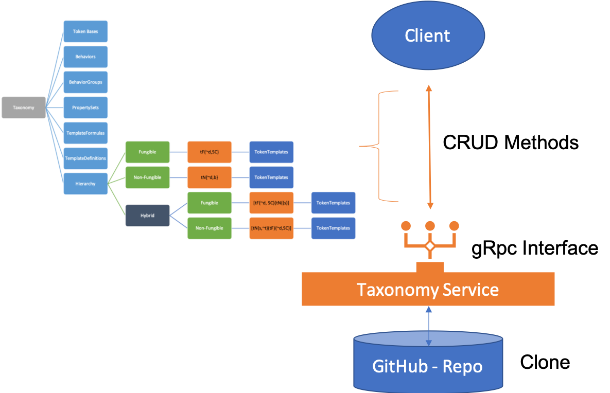
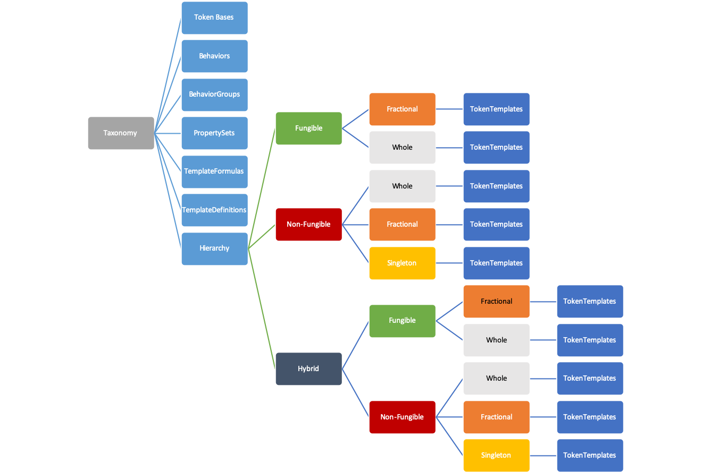

# Taxonomy Model

The Token Taxonomy Framework is a Github, file system based collection of artifacts that are comprised of text only files. Using Github and text as the backend data store for the taxonomy allows for a collaborative process between participants to make updates or changes and have those changes tracked over time and across versions.

However, Github and the file formats used for taxonomy artifacts is not designed or intended for direct consumption by general or non-technical audiences. And the TTF is designed for integration and extension via referencing code, implementations or regulatory/legal frameworks.

To create a good programable experience and easy integration, a Taxonomy Model is used to represent that backend for consumption and update from any sort of application. The TTF has no "rendering or UI" out of the box, by design. But by providing a [gRpc](https://grpc.io/) interface, which can also have a REST facade, anyone can build a "client" for the taxonomy using the model.

The [TaxonomyService](tools/readme.md) provides CRUD capabilities for the backend Github (local clone only for now) to be able to interact with the taxonomy without having to program against the Github API directly.

This approach will allow for general and business user experiences in Web pages, mobile applications, MS Office, Google Docs, Adobe, etc. to be developed and hosted by anyone. Additionally, developer tool plug-ins for Visual Studio, JetBrains, Eclipse, etc. can be developed for that audience as well.

The Taxonomy Model serializes to JSON, which stores all the metadata and definitions.  [Artifacts](taxonomy-artifact-format.md) are stored in folders underneath a parent based on their type: Base, Behavior, Behavior-Group, Property-Set and TokenTemplates.

The folder is named after the artifact name and contains 3 files initially:

- .json - the artifact object serialized from the model.
- .proto - the artifact's control descriptions
- .md - the artifact's additional documentation or UML models
- .docx - a documentation file that is created by the [TTF-Printer](tools/Readme.md).

Other files can be placed in the artifact folder and be read into the model in binary. This is turned off for now, depending on requests if this is necessary.

## TOM - Taxonomy Object Model

The object model provides the structured data for artifacts that is extensible via metadata for each artifact.  It serializes to JSON and de-serializes into a native object model using Protocol Buffers, proto3, for all major platforms.

For a detailed overview of the model see [TOM](model/tom.md).
