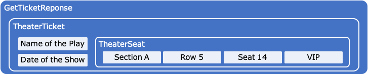

# Token Control Messages

The taxonomy uses [Protocol Buffers (proto3)](https://developers.google.com/protocol-buffers/) or protos to define messages as they are language and platform neutral, extensible mechanism for serializing structured data and provide native developer experiences as well as ideal for implementing messaging or RPC based interfaces.

The specification's messages can be extended and compiled using any supported proto implementation, which includes most platforms and languages. However, the proto definitions can also be used as a reference by new implementations creating messages following the proto naming and typing to match the standard.

Using messages with expressive naming can be understood easily without serialization bloat using the default proto binary serialization. The [proto style guide](https://developers.google.com/protocol-buffers/docs/style) is followed for the standard messages.

Transport protocols for messages are not defined in the standard, however implementing [gRpc](https://grpc.io/) for RPC or AMQP for messaging are recommended.  The transport and mapping to specific blockchain or ledger implementations will dictate how you communicate with token instances.

The primary use of these definitions are for clearly defining interactions with framework artifacts using sequence and other diagram types to improve requirement definitions and an intersection between business and regulatory requirements and implementation inputs and outputs.

## Request/Response

Messages that are invoking a behavior and expecting a response use `Request/Response` pairs and should be named as to be easily understood.  

Transferable *t*, for example, can be made into a set of messages called `TransferRequest` and has fields for To and Quantity properties.


```protobuf
message TransferRequest {
    MessageHeader header = 1;
    string token_id = 2;
    string to_account_id = 3;
    bytes quantity = 4;
}
```

Which can then have a corresponding `TransferResponse` that includes the Token Id and a receipt.


```protobuf
message TransferResponse {
    MessageHeader header = 1;
    string token_id = 2;
    string to_account_id = 3;
    bytes quantity = 4;
    TransactionConfirmation  confirmation = 5;
}
```

Transferable also has a `TransferFromRequest` and `TransferFromResponse` pair. See the sample [Transferable Control](control/transferable/transferable.proto) messages for more detail.

Proto messages allow for missing properties needed for a specific blockchain implementation to be added to the end without breaking the messaging interface.  Changing the order number for the base messages will break compatibility.

## State or Property Messages

A token’s messages also represent properties for its state or logical schema. Control messages are for invoking a behavior or action which may return a property message containing token state.

For example, here is a `GetTicketRequest` control message for a ticket token.


```protobuf
message GetTicketRequest {
    MessageHeader header = 1;
    string ticket_id = 2;
}
```

Which has a companion response message that contains a property message representing the properties of the ticket.



```protobuf
message GetTicketResponse {
   MessageHeader header = 1;
   TheaterTicket ticket = 2;
}

message TheaterTicket {
   string name_of_the_play = 1;
   string date_of_the_show = 2;
   TheaterSeat theater_seat = 3;
}
Message TheaterSeat {
   string section = 1;
   string row = 2;
   string seat = 3;
   bool vip = 4;
}
```

Some control message requests may return non-state data like transaction receipts or errors.  

## Base Schema and State Messages

Base schema is expressed in messages defining the properties tokens that implement the base should implement.  The message definition is not the token implementation, but rather message payload that the token implementation state variables can be placed in when responding to a behavior or action.

For example, the root of the tree is a common base token or β which has an owner Id, name, symbol, quantity and decimals property.

```protobuf
message Base {
   TokenTaxonomyDefinition token_interface = 1;
   string owner_id = 2;
   string name = 3;
   string symbol = 4;
   bytes quantity = 5;
   int32 decimals = 6;
   repeated TokenProperty token_properties = 7;
}
```

*TokenTaxonomyDefinition will be explained in the next section.*

There is also a base behavior bundle that includes simple GetTokenRequest/Response and GetTaxonomyRequest/Response message pairs.  

The TokenTaxonomyDefinition contains the taxonomy identifiers for its root and the standard behavior bundles and groups it has as well as a collection of custom behaviors.

```protobuf
enum TaxonomyRoot {
   F_S = 0;
   F_W = 1;
   N_F_S = 2;
   N_F_W = 3;
}

message TokenTaxonomyDefinition {
   TaxonomyRoot root = 1;
   repeated string behavior_bundles = 2;
   repeated string behavior_groups = 3;
   repeated CustomBehavior custom_behaviors = 4;
}

message CustomBehavior {
   string proto_name = 1;
   string proto_version = 2;
   string source = 3; //where to obtain the proto definition if you do not have it
   google.protobuf.Any request = 4;
   google.protobuf.Any response = 5;
}
```

## Message Headers

In addition to defining these standard messages,  standard headers will likely be determined in the development of the specification that can include meta data like version, return type, etc.

```protobuf
message MessageHeader{
    string version = 1;
    CustomMessageHeader custom_message_header = 2;
}

message CustomMessageHeader{
    google.protobuf.Any custom_message_header = 1;
}

message GetTokenTaxonomyDefinitionRequest {
    MessageHeader header = 1;
}

message GetTokenTaxonomyDefinitionResponse {
    MessageHeader header = 1;
    TokenTaxonomyDefinition token_interface = 2;
}
```

Message headers are very useful when placed consistently in a specific position like `1` as it can contain known typed data when the remainder of the message does not need to be understood.

## Control Message Standards and Examples

The [proto definitions located in their respective artifact folder](artifacts) are not complete or comprehensive and are a starting point in the standardization process.  The Taxonomy standard will generally apply to well understood base token types and behaviors and groups.
