# Token Taxonomy Framework (TTF) - January 2021

The Token Taxonomy Framework bridges the gap between blockchain developers, line of business executives and legal/regulators allowing them to work together to model existing and define new business models and networks based on tokens. The blockchain space alone makes it difficult to establish common ground, but when adding tokens to the mix they find themselves speaking completely different languages. The framework’s purpose is to:

- Educate – take a step back and CLEARLY define a token in non-technical and cross industry terms using real world, everyday analogies so ANYONE can understand them using properties and behaviors to describe and define them.
- Define a common set of concepts and terms that can be used by business, technical, and regulatory participants to speak the same language.
- Produce token definitions that have clear and understood requirements that are implementation neutral for developers to follow and standards organizations to validate.
- Establish a base Token Classification Hierarchy (TCH) driven by metadata that is simple to understand and navigate for anyone interested in learning and discovering Tokens and underlying implementations.
- Deliver tooling meta-data using the TTF syntax that enables the generation of visual representations of classifications, and modelling tools to view and create token definitions mapped to the taxonomy.
- Use terminology that is neutral to programming language and blockchain, distributed ledger or other distributed medium where tokens reside.
- Encourage open and collaborative workshops to accelerate the creation of powerful vertical industry applications and innovation for platforms, start-ups, and enterprises.
- Produce standard artifacts and control message descriptions mapped to the taxonomy that are implementation neutral and provide base components and controls that consortia, startups, platforms or regulators can use to work together.
- Encourage differentiation and vertical specialization while maintaining an interoperable base.
- Include a sandbox environment for legal and regulatory requirement discovery and input
- Be used in taxonomy workshops for defining existing or new tokens which results in a contribution back to the framework to organically grow and expand across industries for maximum re-use.

It is **NOT**:

- Specific to the Ethereum family but applies to any shared medium - whether it be a blockchain or database.
- A Legal or regulatory framework - but it does establish common ground.
- Complete or comprehensive. It is intended to be expanded over time.

This document does not provide a background on Tokens and their function, but rather introduces the taxonomy and classifications as a composition framework for creating or documenting existing token definitions. However, it is worthwhile to establish foundational definitions for two concepts: what a token is, and what is often called a wallet or an account.

A token is a digital representation of some shared value. The value can be intrinsically digital with no external physical form or be a receipt or title for a material item or property. A purely digital token represents value directly, where the other references that actual value, or at least a claim to it. For example, a crypto currency like Bitcoin is intrinsically digital since it has no referenced physical form, but 1 kg of tokenized gold would.

An account or wallet (which can aggregate several accounts) represents a repository of tokens attributed to an owner. An owner is given an "address" which uniquely identifies the owner, and the owner possesses the key to that address. A token's owner is a reference to an address and a wallet is a reference to an address for an owner. The wallet can provide a view into token balances in one place for the owner, much like a bank account or bank summary of accounts.

See the [Token Hall](https://medium.com/tokenhall) for a backgrounder for business and technical audiences.

## Common Terminology

The TTF is a composition framework that breaks tokens down into basic reusable parts - base token types, properties and behaviors - which are then placed into a category by type and can support grouping. Each decomposed part is documented in a taxonomy [artifact](taxonomy-file-format.md). Composing these token parts together generates another taxonomy artifact defining a complete token by referencing its component artifacts.

The taxonomy uses these terms for all tokens:

- Token Template - describes a token based on its type and what capabilities or restrictions a token created from the template would have (i.e. Fractional Fungible Template). A template has two parts:
  - Template Formula - a set of reusable taxonomy components that, when combined, is used to classify and describe how to work with a token.
  - Template Definition - is derived from a formula, filling in the details to define a token that can be used to deploy as a class (i.e. Cryptocurrency Token Definition).
- Token Class - is an deployed token from a Template. (i.e. Bitcoin created from the crypto-currency template). A token class can have one or more token instances.
- Token Instance - a single token in a particular Token Class. (i.e. satoshi balance in your crypto-currency wallet).

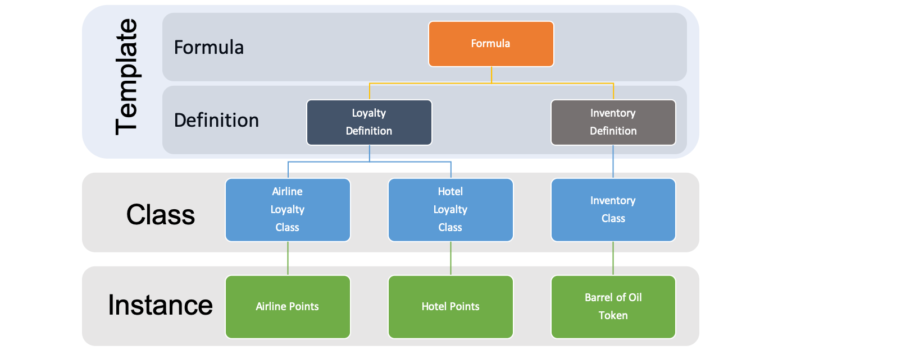

### Template Formula and Definition

Templates are like recipes that have a list of ingredients, details about the measurements of each ingredient, how to mix them together, and finally how long to cook.

Templates have two parts, the first of which is the template Formula. It is like the list of ingredients for a recipe. The second part is the Definition that contains the instructions and details for defining a token, like the step by step instructions of a recipe.

The elements of a Formula (base types, behaviors, and property sets) will be described later.

### Token Class vs. Instance

A token class is a deployed template using a specific implementation or platform, e.g. Ethereum blockchain. Depending on the target platform the implementation may be a complete set of source code or a software package from a 3rd party.

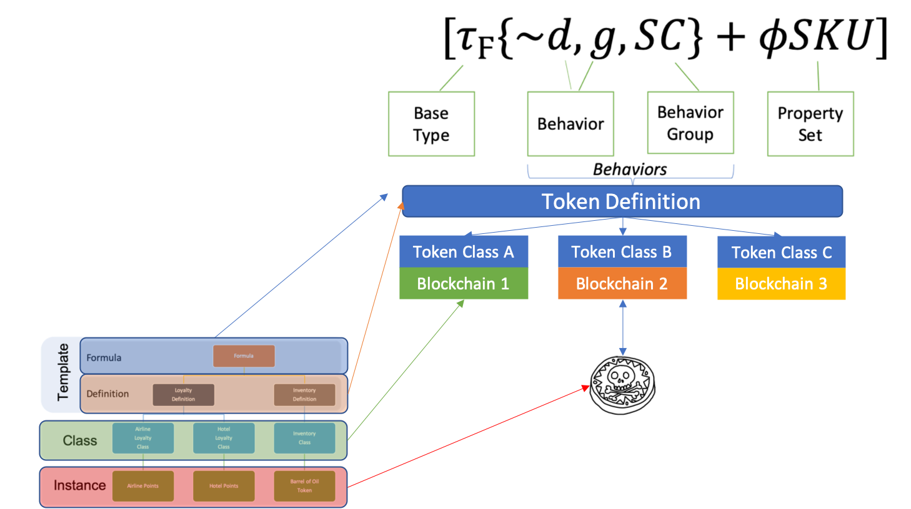

A token instance is an owned token of a particular class. Depending on the platform how this notion is actually implemented will vary. Instances of a token that you may own, or have in your digital wallet, represent your account balance of that token class.

### Taxonomy Artifacts, Categories, and Templates

The taxonomy is comprised of artifacts that are categorized into 5 basic types:

- Base Types: the foundation of any token is its base token type.
- Behaviors: capabilities or restrictions that can apply to a token.
- Behavior Groups: a bundle of behaviors that are frequently used together.
- Property Sets: a defined property or set of properties that - when applied to a token - can support a value that can be queried.
- Token Templates: a composition of artifacts brought together to create a classification and detailed specification. There are 2 parts of a template, the formula and definition.

The TTF is comprised of artifacts, which are just sets of files that share a common set of metadata and consistency for defining items and compositions in the framework. For example, suppose we were baking a cake using a recipe. An artifact is like an ingredient that can be used in the recipe, e.g. milk, sugar, flour. The recipe pulls together the ingredients by specifying how much of each ingredient to add, when and how long to cook. In this analogy, ingredients are Artifacts and a recipe is a Token Template.

### Artifact References and Templates

An artifact is a verbose description of the TTF component it represents with place holders for settings or properties that the artifact can have when used. Every artifact has an artifact symbol, which contains a unique identifier as well as visual and tooling symbols used in the taxonomy. The artifact’s unique identifier allows for each artifact to be independently versioned. An artifact reference can be a lightweight link to the artifact’s unique identifier or a complete reference that also provides settings and values for its place holder properties.

To use an artifact, you simply reference the artifact and apply overlay values for the artifacts in a template definition. Artifacts are reusable definitions, like when a recipe calls for milk, you only need one definition of what milk is so you can just reference it and indicate how much milk the recipe calls for. When composing a Token Template, you are creating references to all the artifacts, i.e. ingredients, in the formula and providing details about each of the artifacts in the definition.

When creating a Template Formula, it uses a symbol or lightweight reference, which is only a pointer to the artifact with no other values or settings.

A Template Definition, which is created from a formula, uses a full artifact reference, which contains values and settings specific for the artifact in the context of the token definition.

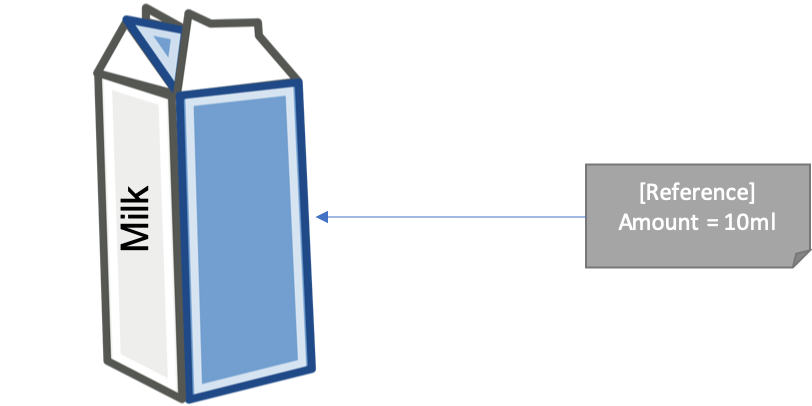

Using references in this way prevents data duplication in the TTF, and specification changes flow through existing Template artifacts without updating it in each one.

### Classification Hierarchy

The TTF creates a hierarchy or tree of Templates where each Template Formula is a branch. A branch can have other branches and leaves, or nodes that are represented by the Template Definition. The hierarchical tree is constructed starting with foundational classifications, like Fungible or Non-Fungible as roots of the tree and branches are represented by Templates. Branches are related by their classifications and formula to create the hierarchical relationship structure. A leaf or node is a Template Definition based on a formula. Formulas can have multiple definitions where the definitions have different settings and property values for the artifacts in the formula.

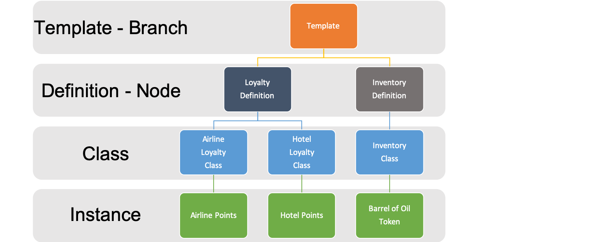

References are followed through the hierarchy and back to the Artifacts to validate and determine what instance values can be set in the instance.

### Control Messages

Behavior and Property Sets contain `Control` message descriptions that are used to invoke a behavior or get/set the value of a property. These control messages are described in the artifact for the behavior or property set. `Control` messages are named descriptively and come in request and response pairs. `Control` messages contain optional named parameters of a specific type for requests and responses.

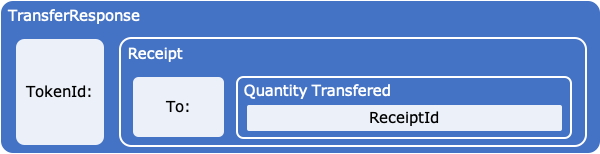

These messages are generic for the behavior and not specific to any blockchain implementation or programming language. Control messages are described as invocations within an artifact and optionally in a separate file using Protocol Buffer syntax that can be used for TTF extensions like code generation or testing. For more detail on the specification definitions see [Token Control Messages](./token-control-messages.md).

## Token Classification

The TTF classifies tokens using five characteristics they possess, allowing tokens that share the same characteristics to be classified together. These are foundational token concepts that can be applied to most tokens.

- Token Type: Fungible or Non-Fungible. The difference between the two is clarified later in this document
- Token Unit: Fractional, Whole or Singleton indicates if a token can be divided into smaller fractions, usually represented as decimals, or if there can be a quantity greater than 1. For example, a \$1 bill can sub-divided to 2 decimal places and can be broken into four .25¢ coins (or a number of different variation of coins) and is thus Fractional. Whole means no subdivision allowed - just whole numbers quantities - and a Singleton has a quantity of 1, is indivisible and is the only token in the class.
- Value Type: Intrinsic or Reference indicates if the token itself is a value, like a crypto currency, or if it references a value elsewhere, like a property title.
- Representation Type: Common or Unique. Common tokens share a single set of properties, are not distinct from one another, and balances are recorded in a central place. These tokens are simply represented as a balance or quantity attributed to an owner’s address where all the balances are recorded on the same balance sheet. A unique token has its own identity, can have unique properties, and be individually traced. Common tokens are like money in a bank account and Unique tokens are like money in your pocket.
- Supply: Fixed, Capped-Variable, Gated or Infinite. Supply indicates how many token instances, usually counted as whole instances, a token class can have during its lifetime. A token class that is fixed may issue an initial quantity upon creation, tokens cannot be removed or added to the supply. A capped-variable supply will allow for a maximum number of tokens to exist at any given time, with quantities added and removed within the quantity cap. A gated supply is common in crypto-currencies, where tranches of tokens are issued at certain points in time or events. A gated supply indicates up front the quantities in each tranche and when the tranche is issued that will represent the total quantity for the class, like a cap. Infinite supply indicates that tokens in the class can be created and removed with no cap and also potentially reflect negative supply for certain business cases.
- Template Type: Single or Hybrid, covered later, but is an indication of any parent/child relationships or dependencies between tokens.

Classification is useful when visualizing different token types and learning about the basic characteristics a token would need to have when you are using the TTF to define it.

## Base Token Types

The taxonomy is anchored by a single root token that is used to define properties shared by the two implementable or base token types. Properties like a common name, a symbol or unique identifier a quantity and an owner. When you create a token, you are initially creating a token or asset class of a specific type of token that will represent instances of the token.

The root token also contains a single behavior called constructible. This behavior provides tokens with the ability to be a template, or to create a clone of itself. Constructible simply means that every token template will have a constructor control message to define initialization values when a clone of a template is created and is defined in the token template artifact.

Using the taxonomy, a token template is defined that is to be used to create a token or asset class. The class is essentially a mold for creating instances (printing or minting) of that token type. An instance of a token class is the smallest unit that can be owned in that class.

The taxonomy uses symbols to represent token bases and possible behaviors that are used to create a token definition as a formula. The symbols and token formulas can be used to create hierarchical relationships useful for visualizations, and to aid in learning and design. The two base types can also be combined in different ways to create hybrid token definitions.

### Fungibility vs Non-Fungibility

Fungibility as we often define things in the token world seems to have more to do with "Financial Fungibility" and methods of accounting for an asset OR it has to do with characteristics related to the usage of the asset rather than a pure native built-in fungibility characteristic.

> Per Merriam-Webster: Fungible is defined as: being something (such as money or a commodity) of such a nature that one part or quantity may be replaced by another equal part or quantity in paying a debt or settling an account OR capable of mutual substitution : INTERCHANGEABLE

### Determining Fungibility

Hypothesis: it is difficult for people to say what something is and for people to agree on that definition without first analyzing and describing the properties and behaviors of what it is they’re defining.

Finding the answer requires a different approach, like asking the questions and then once understanding and noting similarities to other things of a similar form, fit and function then we come to a conclusion and define what it is.

Starting with the very first question "Is it Fungible or Non-fungible?" This is the most difficult question to start with. Instead can we ask the questions:

- Does every instance of what I am talking about have precisely the same value (This question ignores the divisibility aspect for now) and financial properties?
- Do all instances have precisely the same form and fit properties?
- Does every single instance exhibit the same exact built-in or "native/natural" behavior (properties that don't depend on how it is being used)?

### Fungibility vs Non-Fungibility Examples

#### Printed & Digitally Native Currency

Similarities - Physical currency (printed US Dollar denominated bills) and digitally native (US Dollars introduced into the money supply without printing new paper bills) US Dollars for the purposes of calculating value are "financially" fungible. They can be used for tracking value (store of value), used as a unit of account and provide a medium of exchange without regard for treating the financial instrument differently.

Differences - Physical currency has serial numbers, issue dates, etc that make it truly non-fungible in a track and trace usage. Indeed, the central banks spend significant effort to ensure all printed money can be uniquely identified despite the fact that all \$20 bills "spend" the same.

#### People

Differences - every person is truly unique and natively non-fungible who can mostly be identified by DNA and/or uniquely identifiable characteristics (including identical twins who are DNA equivalent).

Similarities - the usage of people can make a person seem fungible for example as a juror. Whether a man, woman or gender neutral, their vote on the jury has a method of accounting that is the same (1 juror 1 vote). Each vote is unique to the juror but the accounting of the votes is equivalent

#### Discrete Manufactured Items (iPhones, cars, airplanes and those things assembled by components)

iPhone Similarities - all iPhones are built in Batches all items in a Batch are precisely the same. Batches are built within a certain time period to precisely the same specification called a Bill of Materials (BOM). The BOM defines down to the exact manufacturer and part number plus revision of (usually) every discrete component (chipset, antenna, touch screen, etc) within the iPhone.

When there are many Batches where the form, fit and function and are intended to have the uniform quality can be simplified for tracking into Lots to make it easier for the general tracking functions of the asset until it is owned or activated.

All iPhones that meet the form, fit or function equivalency tests will be financially tracked as equivalent assets and assigned a SKU barcode that is used to identify it during the purchasing process so in this usage, the iPhone is "acting" in a fungible way for accounting purposes and for performing a task with uniform outcomes.

iPhone Differences - iPhones are each assigned a serial number (IMEI Number) because each iPhone was produced in a different Batch/Lot and needs to be tracked as such. The IMEI Number also makes it unique for activation purposes and it becomes 100% fully unique once you buy it and install your specific apps and services.

#### Process Manufactured Items (Oil, gasoline, orange juice, pharmaceutical drugs, bolts, screws, etc)

Bolts/Screws Differences - these are made in Batches but tracked for financial/inventory purposes based on the packaging (generally as Lots) which have an assigned SKU. Each Lot is non-fungible because it is uniquely produced under certain conditions at a particular factory using particular raw material sources and is trackable at the Lot level. If there is ever a failure of a bolt it can be tracked via Lot Number to the exact location & process used to manufacture it.

Bolts/Screws Similarities - It is fungible at the packaging level and for accounting purposes and is sometimes trackable based on engineering standard it certified to (e.g. ASTM A354 standard that defines chemical and mechanical properties of bolts and threaded fasteners).

Pharmaceutical Drugs - they are tracked in a similar way to screws/bolts.

Oil - Crude oil is tracked from source into the pipelines as a unique asset until it gets to a merge point with other oil supplies and then it is tracked as a mixed asset like West Texas Crude Oil.

#### Food Commodities (Wheat, corn, etc)

Similarities - It is generally acceptable to track a bushel of wheat or corn as a fungible (interchangeable) unit in its usage and monetary value.

Differences - If, however, it is determined that wheat or corn from a certain country or farm has a different form or function or maybe has been found to have an issue affecting public health, we might need to track it in many ways as a non-fungible asset.

### Determining Fungibility Characteristics

In reality, many assets in the Enterprise Token Ecosystem are going to be Hybrid Tokens. Determining the best token representation is more complicated and requires collaboration and discussion. Steps to focus the discussion might include:

1. Seek to understand the properties of the asset to be represented via a Digital Token. Separate natively/naturally properties of a Token vs the behavior and usage of the Token
2. Break things down deeper than purely Fungible vs Non-fungible. A tF', unique fungible would be able to have a unique serial number and also be financially fungible. Consider possible categories of fungibility (for example Financially Fungible, Form or Fit Fungible or Functionally Fungible)

### Fungible

Physical cash or a crypto currency is a good example of a fungible token. These tokens have interchangeable value with one another, where any quantity of them has the same value as another equal quantity if they are in the same class or series.
A fungible token is identified by **&tau;F** symbol.

### Non-fungible

A non-fungible token is unique. Hence a non-fungible token is not interchangeable with other tokens of the same type as they typically have different values. A property title is a good example of a non-fungible token where the title to a broken-down shack is not of the same value as the title to a mansion.

A non-fungible token is identified by **&tau;N**.

Non-fungible tokens can be whole, fractional or singleton. Whole and fractional non-fungibles of the same type can be deployed in the same class, where each instance of a token in the class can share some property values with other tokens in the class AND have distinctly unique values between them.

A singleton, is where there is only one instance in the deployed token class and that instance is indivisible. Singletons are useful if there is an asset or object to be tokenized that shares no properties or values with any other object.

> A Singleton is a class unto itself.

### Representation Type

Tokens can have either a common representation, sometimes called account or balance tokens, or unique representation, or UTXO (unspent transaction output). This distinction might seem subtle but is important when considering how tokens can be traced and if they can have isolated and unique properties.

Common tokens share a single set of properties, are not distinct from one another, and balances are recorded in a central place. These tokens are simply represented as a balance or quantity attributed to an owner address where all the balances are recorded on the same balance sheet. This balance sheet is distributed, not centralized, and rather simplified. Common tokens have the advantage of easily sharing a value like a "SKU" where the change in the value is immediately reflected for all tokens. Common tokens cannot be individually traced, only their balances between accounts can.

Bank accounts are an example of a common fungible token.

Unique tokens have their own identities and can be individually traced. Each unique token can carry unique properties that cannot be changed in one place and cascade to all and their balances must be summed.
Bank notes and paper bills are interchangeable but have unique properties like a serial number and are therefore examples of unique fungible tokens.

A unique token is identified by `'` following the type symbol, i.e. **&tau;F'**.

### Hybrids

Hybrid tokens combine a parent token and one or more child token(s) to model different use cases. Hybrids can get nested where a child token is also a parent for more complex scenarios. Here are some examples.

#### Shared Non-fungible Parent with Fungible classes

These tokens have a non-fungible parent or base token and can have multiple classes of child tokens. An example of this hybrid is a rock concert, where the parent token represents the specific date or showing of the concert with a fungible child for general admission and a non-fungible child for "reserved" section seating. Represented as **&tau;N**(&tau;F, &tau;N).

The owner of an instance of this token will possess the child token that pulls along the parent and is presented at the concert gate for admission. If the parent token date matches the current date the token is valid for admission. If the child token that is owned is in the reserved seating section, the owner has the right to sit in the seat indicated by the token.

#### Fungible Parent class owns or has many non-fungible Children

A token can be the parent of any number of tokens to represent the compound value of the child tokens. For example, a **&tau;F**(&tau;N) is a fungible token parent that is the owner of one or more non-fungible tokens. An owner of an instance of this parent would own a percentage of the pool of non-fungible child tokens. A mortgage-backed security is a good example of this type of hybrid token.

## Properties

Properties of a token are used to define the information or data a token contains about itself and to record its activities. Some properties are set when the token class is created from a template, like its name and owner while others are set and updated over a token’s lifetime. How a property value is set determines what type of property it is.

- Behavioral Property: If a property's value must be set or read by a behavior, it is called a behavioral property.
- Non-Behavioral Property (Property Set): If a property can be set independently from a behavior it is a non-behavioral property or property set.

The difference in these two types is often sematic but is key to understanding a property's overall scope.

- A Behavioral property value is not determined directly but controlled by logic contained in a behavior. Setting its value is the result of a calculation or logic based on an action in its controlling behavior. Visibility of its value may or may not be obtained directly from an explicit control message. A behavioral property is defined in a behavior artifact.
- A behavioral property may not have meaning or even be visible to observers outside of a token behavior.
- A non-behavioral property has its own "getter and setter" defined in a Property Set artifact. Which means it will have controls for getting and setting its value directly.

Non-behavioral properties, like a serial number, reference properties or generic tags, can be added to a token without effecting its behavior.

For example, you can create a property title token that uses a non-fungible token template and adds non-behavioral properties like a map number and plot location to create a new template. You can repeat this process for an art token that uses the same non-fungible token template and adds different non-behavioral properties needed to represent it. Even though these two tokens started with a common template, they expose different non-behavioral properties.

Non-behavioral properties are defined in a property set artifact. A property set artifact can contain the definition of a single field property like a SKU or multiple field properties like a Mailing Address. A property set can represent a complex property like a Customer that contains fields like First Name, Last Name, Address (a nested property), etc. Property sets can can have other nested property sets as well as be repeated, meaning it can be a list of property set. Also, a property set has a representation that can be common or shared for all tokens in a class, like a SKU, or unique for each token in the class like a serial number.

Property sets have a **&phi;** prefix and in all capital letters or acronym that is unique for the taxonomy. For example, **&phi;SKU** could be used for the `SKU` property set. Adding a non-behavioral property set to a token template requires it to be specifically added to its formula. A property set with a unique representation will have a ''' following its symbol. i.e. **&phi;SKU'**

Property sets that can be a list, collection or array of the property set, either at the token level or nested within another property set will have a r following its symbol, before a possible unique indicator, **&phi;FILEr'** and its tooling symbol will include a lowercase `r` following the property set symbol `phFILEr`. For regular properties or nested property sets, there is a `repeated = true` attribute in the artifact that can be set to indicate that the property is a list, collection or array of the property.

Some token properties from its base may have different values or meaning depending on the context when evaluating them. For example, the Owner property in the context of the token class refers to the creator or owner of the token class, which may come with permissions to mint or issue new tokens of the class but does not have permissions on any specific instance of the token class. In the context of a token instance, Owner is the owner of that token instance and will have all the permissions that come with owning the token itself, like spending or transferring ownership of the token.

## Behaviors

Behaviors are capabilities and restrictions containing logic and properties that can be common across token types. In the TTF, behaviors use the first letter of the behavior as its representation. Letter collisions can be avoided by adding additional letters from a single word name or the letter of a second word.
Behaviors usually have existing “non-blockchain” implementations which are well understood in business contexts.

### Common Behaviors

This is a list of some common behaviors and is not intended to be comprehensive, as the TTF is a working standard where artifacts are improved and added on a regular basis. This process is covered in more detail later in this document.

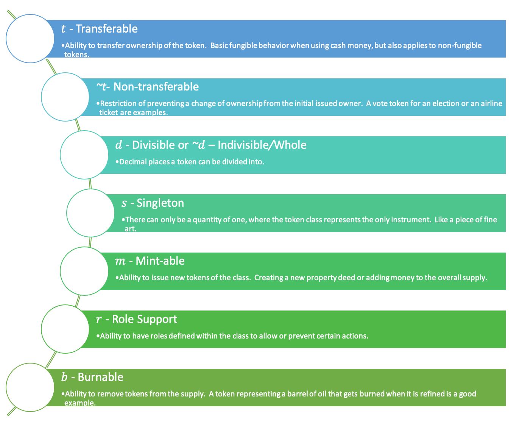

Some of these behaviors are valid for either base type, while others only apply to one. For example, ~t (non-transferable) would not make sense for a fungible token, and d (divisible) does not apply to a token with the s (singleton) behavior.

A behavior that is not valid for a specific type or conflicts with another behavior it will include the symbol reference in its incompatible list.

Where hybrid tokens are being defined, behaviors can be defined that are common to all tokens, or at different granularities. For example, the following definition is for a fungible parent token that does allow new tokens to be minted, and child non-fungible tokens that cannot be minted. However, both classes of token are transferrable:

> **[&tau;F{m} (&tau;N{~m}){t}]**

For boolean behaviors like Divisible d or Whole ~d, the absence of ~d would imply d but should be explicitly included for clarity.

Some behaviors, like Transferable t are implicit for certain token bases. A fungible token, for example, implicitly is Transferable so the taxonomy does not require it to be included for tooling or the template but again should be explicitly included for clarity: &tau;F = &tau;F{t}.

### Special Behaviors and Interactions

Some behaviors, when applied, will affect other behaviors within the token definition. These behaviors influence other behaviors in some way when they are combined in the same template. Examples of this are the behaviors Delegable and Roles.

Delegable, g, is the ability to delegate a behavior to another party to perform on your behalf as the token owner. Delegable is implied (the default), so an absence of ~g means the token class and any behaviors that are influenced by its behavior will be delegable.

Behaviors like Transfer and Burn can be defined as Delegable, and when they are applied to a formula that is Delegable, these behaviors will enable delegated invocations like TransferFrom and BurnFrom that allows an account the owner has approved to invoke these on their behalf.
Roles, r, allows for a role or membership check before invoking an influenced behavior in order to determine if invocation is allowed by the invoker.

Potential influences are defined in an artifact and details of regarding influence is detailed in a template definition when the artifacts are brought into context with each other.

Behaviors can be incompatible with each other and cause validation errors. A behavior and its opposite `~` are obviously incompatible. A behavior will indicate what behaviors it will be incompatible with, for example if singleton, s and mintable, m or divisible, d is applied in the same token, validation will fail as a singleton can only have a quantity of 1 whole token.

Some behaviors will require setup at token class creation or construction. A behavior that requires setup should have a Constructor control message that indicates how it should be setup at construction.

### Internal and External Behaviors

Behaviors can be internal or external depending on what the behavior effects. An internal behavior is enabling or restricting properties on the token itself, whereas an external behavior is enabling or restricting the invocation of the behavior from an external actor. For example, the behavior divisible means that the decimals property on the base token is > 0 and non-transferable means that the Owner property is not modifiable from the initial owner that was set when the token instance was created.

Examples of an external behavior would be something like Financeable or Encumberable. These behaviors would enable an external actor to invoke the behavior and the token would contain the correct behavioral properties to record the outcome when invoked. For example, if a Loan contract were to invoke FinanceRequest on a token instance, the loan contract could expect a FinanceResponse back from the token as an indication of the success or failure of this behavior.

The distinction between internal and external behaviors can seem like nuance at first but is an effective way to distinguish pure token behaviors from contract behaviors and document the business logic the behavior represents. External behaviors are primarily contract behaviors that need a supporting token interface to allow the two to be linked together to fulfill the end-to-end functionality.

So, external behaviors will have two parts, contract and token, that are required when describing them. Artifact authors may choose to document the corresponding contract portion of the behavior in an additional artifact file.

## Behavior Groups

Behaviors can also be grouped together to describe a common set of capabilities that are used together frequently. Supply Control is a group made up of Mintable, Burnable, and Roles for adding and removing token supply and by allowing certain accounts in a role to be able to mint new tokens within the class.

For example, an oil token may allow oil producers to mint new tokens as they introduce a barrel of oil into the supply chain. These tokens are transferred to a refiner that will burn the token when it has been refined.

Behavior groups are represented in the taxonomy by a capital letter or acronym, SC, from their full name and reference the symbols for the behaviors they include.

> _SC = {m, b, r}_

This artifact references include settings and property values for behaviors in the same context.

## Template Formula

Template Formulas list all a token's components together. The framework performs an initial validation of the artifacts in context with each other enforcing grammar and rules regarding incompatibilities, dependencies and influences. Formulas start with a base token type, then collections of behaviors, behavior groups, and property sets.

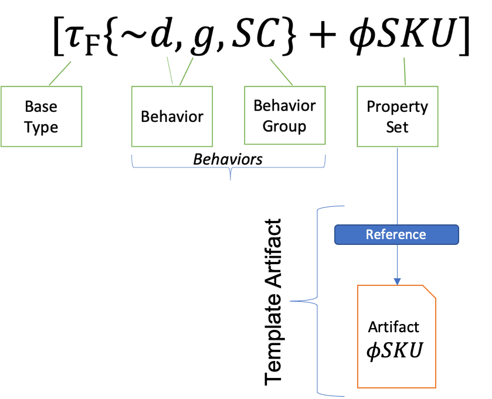

The example above shows a reference to the artifact for the `phSKU` property.

## Template Definition

Once you have created or identified an existing formula, you can use the TTF Service to create a Template Definition from it. The definition incorporates the artifacts identified in the formula as references, where the artifact being used is identified and the settings and property values for the artifact in context are established. The definition has a reference to its formula and the unique identifier given to the definition becomes the id for the Token Template and Token Specification.

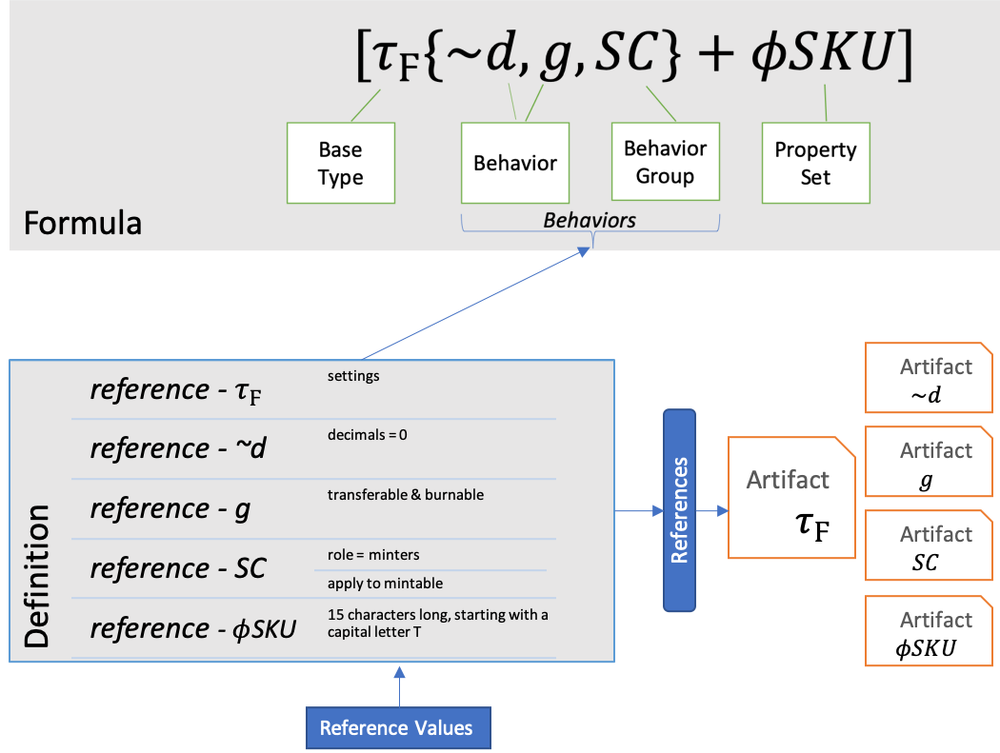

The definition is where the final settings and property values are established for generating a token specification. Contextual documentation and valuable business rules should be explained in this artifact for the specification’s implementors and documentation. As the TTF becomes more and more populated, new token definitions will simply be composite definitions reusing artifacts with different settings and property values providing valuable business documentation for its potential users.

## Token Specification

The TTF can generate a Token Specification document when provided the Template Definition Id. The generation of the specification pulls the complete artifact for base, behaviors, property sets, and children into a specification and then merges the definition reference values for each artifact. This generates a complete and quite verbose token specification that can be used as requirements for developers, documentation and training.

## Branch Classification

A Base token type provides the foundation of a template to which additional artifacts are added to in order to complete a template definition. The base token for a template is either Single or Hybrid, with a token type of either Fungible or Non-Fungible, and finally its Unit is classified as fractional, whole or singleton. Classification is primarily used for creating visualization hierarchies to compare templates and understand relationships between them.

By default, Token Templates are organized in a simple hierarchy by Fungible, Non-Fungible, and Hybrid. Further classification hierarchies can be dynamically generated using the five classification values and the template formula.

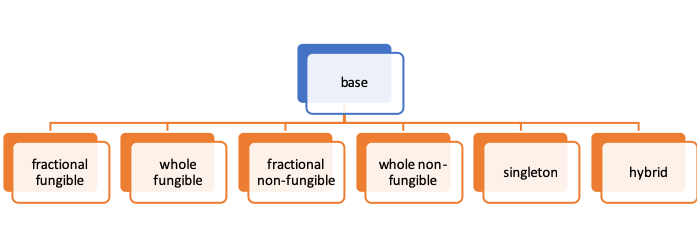

## Taxonomy Model and Artifacts

Artifacts are primarily defined using a platform neutral model that provides type safety and strong schema validation as well as independence from the client display or interface. The Taxonomy Object Model (TOM) is an object model that is very much like an ORM (object to relational model) that is native to most platforms and can serialize to binary or JSON formats.

Above, is a representation of the taxonomy model, where each property of the taxonomy is a list of available behaviors, behavior groups, property sets, formulas, definitions, and templates that are placed in a hierarchical structure.

Below is an example of a template formula in the model showing the collection of its artifacts:

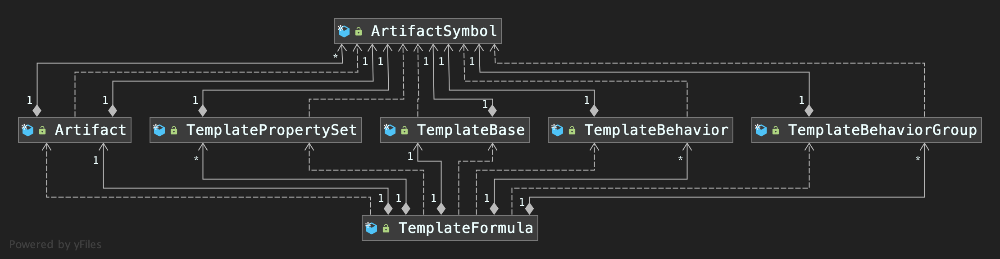

Written in protocol buffers, the schema supports a data structure to hold artifact definitions that anyone can understand. Storing the artifact definition in an object model allows for artifacts to be added or updated using any client interface or imported from files like Word or Google Docs. The model serializes/saves to the artifact folder in JSON format so changes are tracked by GitHub.

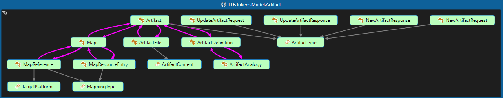

An artifact is more than just a single JSON model file; additional files for the artifact's supporting documentation can be added that include protocol buffer control definitions, sequence diagrams, PowerPoint slides, paired contract behavior documentation, etc. All an artifacts documents are contained within a single folder in the file structure based on the artifact type and version.

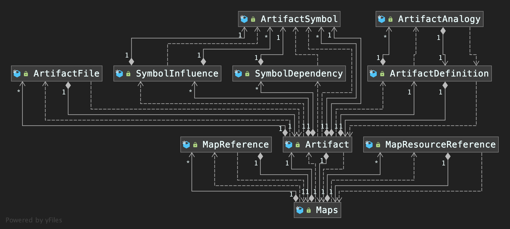

Artifacts are versioned as well, using a version folder, unique id and an optional version number defined in the Artifact Symbol. The most recent version, regardless of its number is stored in a folder called `latest` within the artifact folder name. Previous versions will be in version number folders, where each artifact file for that version is maintained.

An artifact is referenced by its Artifact Symbol and any reference that does not specify an Id will default to latest version.

For an in-depth technical overview of the model see [Taxonomy Model](taxonomy-model.md).

### Behavior Artifact

A behavior’s properties and control messages are packaged together in a behavior artifact.

A behavior may also include things like a sequence diagram to clearly define how a behavior is invoked and how the behavior responds using the defined control message definitions.

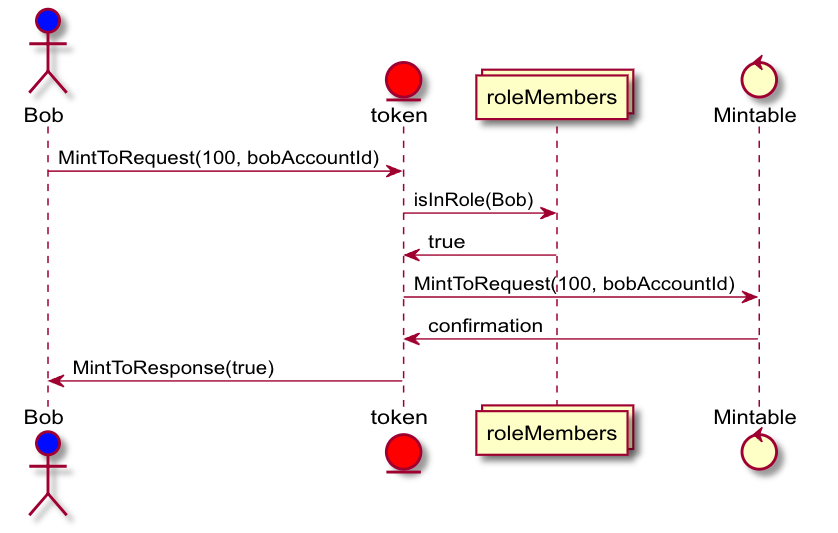

## Taxonomy Grammar

Grammar defines how to construct a formula of artifacts that is recorded as metadata in the artifact for the respective token and used for verification and classification.

The grammar has a visual representation and one for tooling that does not include characters for italics, Greek, super or subscript, etc. Using the grammar, a formula serves as a shorthand definition for the token specification.

The formula uses brackets, braces and parentheses to combine the token parts and starts with the base token type:

|                                      Token Base Type                                      |                        Visual Format                        |  Tooling Format   |
| :---------------------------------------------------------------------------------------: | :---------------------------------------------------------: | :---------------: |
|                                         Fungible                                          |                    **&tau;F**                    |        tF         |
|                                       Non-fungible                                        |                    **&tau;N**                    |        tN         |
|                                      Unique Fungible                                      |                   **&tau;F'**                    |        tF'        |
|                                    Unique Non-fungible                                    |                   **&tau;N'**                    |        tN'        |
|                                   Hybrid – class in (,)                                   |                                                             |                   |
|                          Non-fungible with a class of fungibles                           |            &tau;N(&tau;F)             |    `[tN](tF)`     |
|                          Fungible with a class of non-fungibles                           |            &tau;F(&tau;N)             |    `[tF](tN)`     |
|                   Fungible with a class of non-fungibles and fungibles                    |   &tau;F(&tau;N, &tau;F)   |   `[tF](tN,tF)`   |
|                 Non-fungible with a class of fungibles and non-fungibles                  |   &tau;N(&tau;F, &tau;N)   |   `tN](tF,tN)`    |
| Non-fungible with a class of fungibles and non-fungibles, with each child having formulas | &tau;N([&tau;F], [&tau;N)] | `[tN]([tF],[tN])` |
|                                           etc.                                            |                                                             |                   |

- Behavior is a single _italic_ lower-case letter or letters that is unique.
- Behavior Group is an upper-case letter or letters that is unique with behavior formula encased in `{,}` Supply Control: `SC{m,b,r}`
- Property Sets are prefixed with **&phi;** followed by a upper case letter or acronym that is unique to the taxonomy. **&phi;** is the visual format and `ph` is the tooling. To add a property set to a template, enclose the token definition within [] adding the property set after the behaviors with a + for each set needed. All of the token's behaviors and properties are contained within the surrounding brackets [].
- For example, a Token Branch can be a Formula with just the base and behaviors and can then have a Node that had the Branch formula surround by brackets `[]` and adds using `+` the unique property sets, added within the brackets. i.e. **[&tau;N(&tau;F, &tau;N)+&phi;SKU]**
- Hybrid tokens, represented as children of a base parent are added after the base's [] and contained with in parenthesis (,). These child tokens are also contained within brackets resulting in a formula grouping like: ``
- For hybrid tokens, you can apply behaviors to the entire hybrid definition by ending the formula with a list of behaviors in {,}.
- Hybrid children with formulas are grouped within the formula's[]: i.e. **[&tau;N{s,~t}(&tau;F{~d,SC}]**

A token formula uses the taxonomy symbols, which are references to artifacts, can be used to represent a token that is useful for tooling allowing grouping and structures to be represented. Some examples:

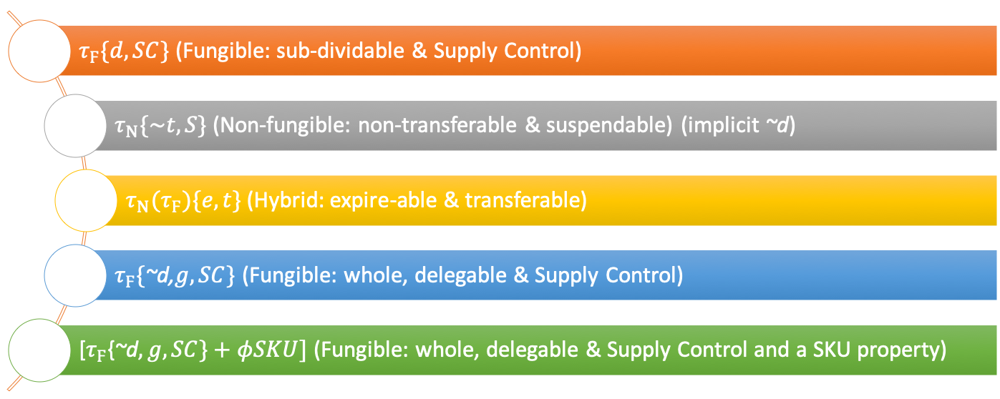

Now we can begin naming and describing tokens starting with the base type followed by the behaviors or group of behaviors. A Token Definition represents our complete token and is basically documenting everything a developer would need to know in order to develop an implementation. Token definitions are given a meaningful name starting with an uppercase letter.

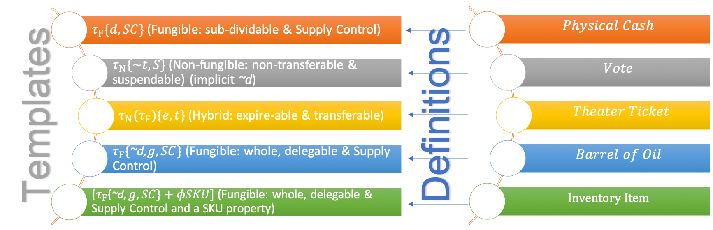

A template formula can have multiple definitions, for example a Fractional Fungible template may define 2 decimal places for subdivision, while another allows for 16.

## Hierarchy

Using the taxonomy, we can now start to construct basic hierarchical relationships creating a token tree structure. Using the underlying taxonomy, tools can create visualizations for learning and comparing tokens and their implementations. The tools become a great design services to define new tokens by composing them from the base token types and adding behavior artifacts and groups.
The root of the tree is a common base token or **&tau;** which has an owner Id, name, quantity and decimals property.

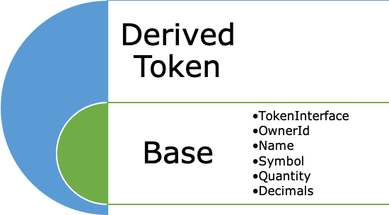

There is also a base behavior artifact that includes simple GetTokenRequest/Response and GetTaxonomyRequest/Response.

There three root branches used to classify templates:

- Fungible - common and unique
- Non-Fungible - common and unique
- Hybrid _&tau;F(&tau;)_, _&tau;N(&tau;)_, etc.
  - Has Fungible and Non-Fungible branches for hybrids by parent.

Each root branch has a branch by Token Unit:

- Fractional Fungible (divisible) _&tau;F{d}_
- Fractional Non-Fungible (divisible) _&tau;N{d}_
- Whole Fungible (indivisible) _&tau;F{~d}_
- Whole Non-Fungible (indivisible) _&tau;N{~d}_
- Singleton _&tau;N{s}_ (s implies ~d)

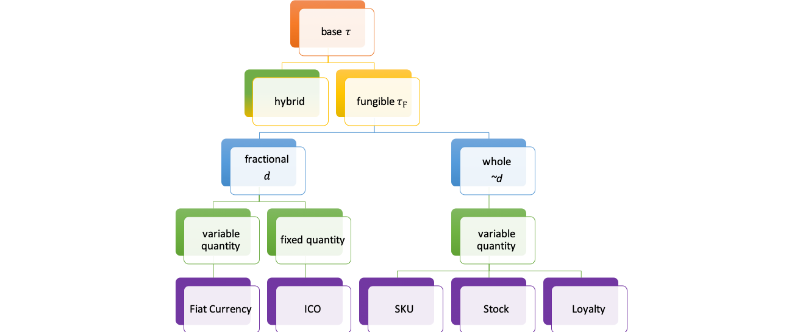

[Hybrid tokens](#hybrids) can reference another branch within the tree to prevent duplication.

Branches on the tree begin to get wider as behavior artifacts and behavior groups are added. The tree visualization makes a good eye chart, but the token design surface becomes a powerful business tool.

### Example Design

As an example, let’s see what a singleton token could look like with a design tool.

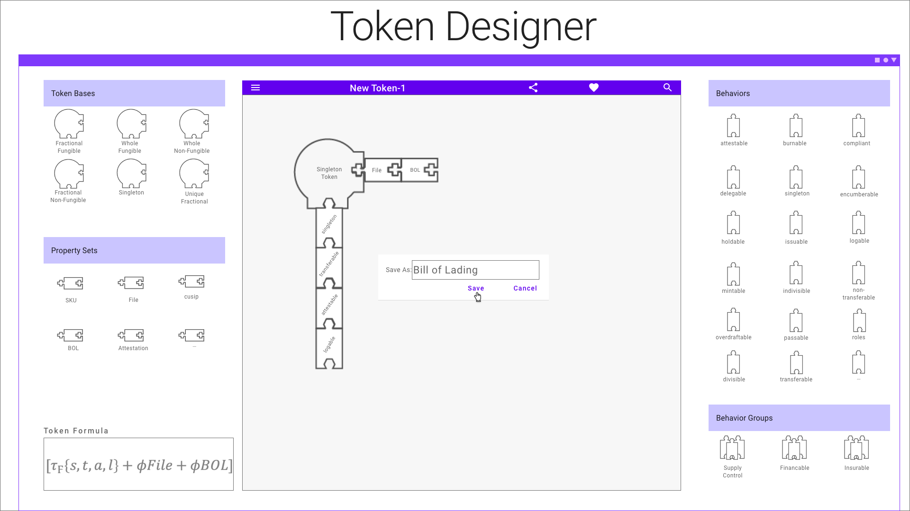

When designing a token using the taxonomy, you will pick from one of these six lower branches of fungible (fractional or whole) and non-fungible (fractional, whole or singleton) or hybrid as a starting design surface.

Behavior artifacts and properties appear in lists like menus you can drag and drop inside your design surface to define a new token. The taxonomy will block behaviors or behavior combinations that conflict or are not valid for the base token type you have selected.

You can then apply the values for settings and properties to provide the detail to the underlying artifacts in the definition. The result is a defined token that has a baseline specification to serve as a starting point for implementing a platform specific token.

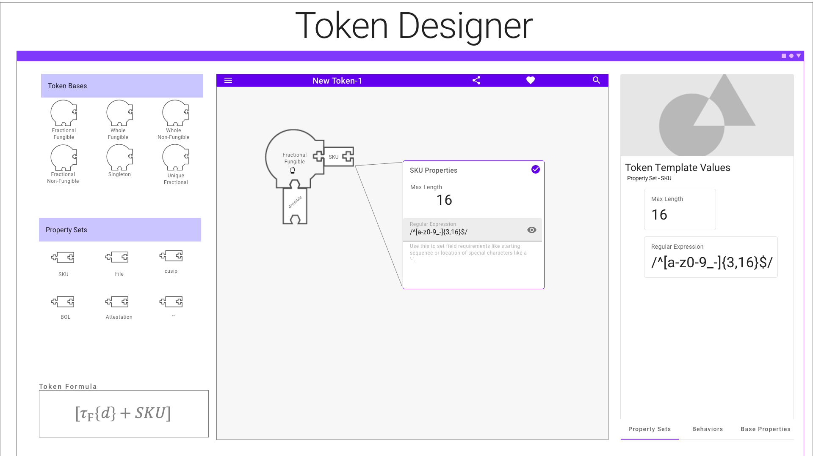

## Taxonomy Hierarchy

If you find a token template that is already defined, but your token has specific non-behavioral properties like a `SKU` or `CUSIP` property you can create a new token template, use the existing template formula and add your properties to create a new template and branch in the taxonomy.

In this case the generic taxonomy definition: &tau;F{~d,SC} or tF{~d,SC} is named Whole Fungible Token with Supply Control and represents a branch off the Whole Fungible branch in the hierarchy.

Adding the SKU property set will be a branch off this branch named `Inventory Item Template`. Your new token template reuses the formula above, adding the `SKU` property set to the formula i.e. [&tau;F{~d,SC}+&phi;SKU].

## Tooling and Taxonomy

Using the TTF to define a token, you ultimately end up with a template formula and definition that defines the specification. The TTF TOM can be navigated using of the symbol tooling formats, to programmatically navigate artifact metadata to generate all sorts of useful outputs from documentation and control messages to visualizations,user interfaces, reports and even implementation code.

The GitHub artifact hierarchical file structure has artifact folder and file names that are the same as the name of the type described in it. The parts in the file system are organized by type folders: base, behaviors, behavior-groups and token-templates.

- base - contains definitions for the base &tau and has a folder for fungible and non-fungible containing &tau;F and &tau;N. Note the metadata in the artifacts uses the tooling format of tF and tN to prevent tools from escaping special characters like < and / used in the visual format.
- behaviors - folder for each behavior.
- behavior-groups - folder for each behavior group.
- property-sets - folder for each non-behavioral property set.
- token-templates - token templates contributed by workshops to the framework.
  - formulas - complete token formula that is the foundation for a template definition.
  - definitions - complete token definition that is based off a formula.
  - specifications - the generated token specification from the template definition.

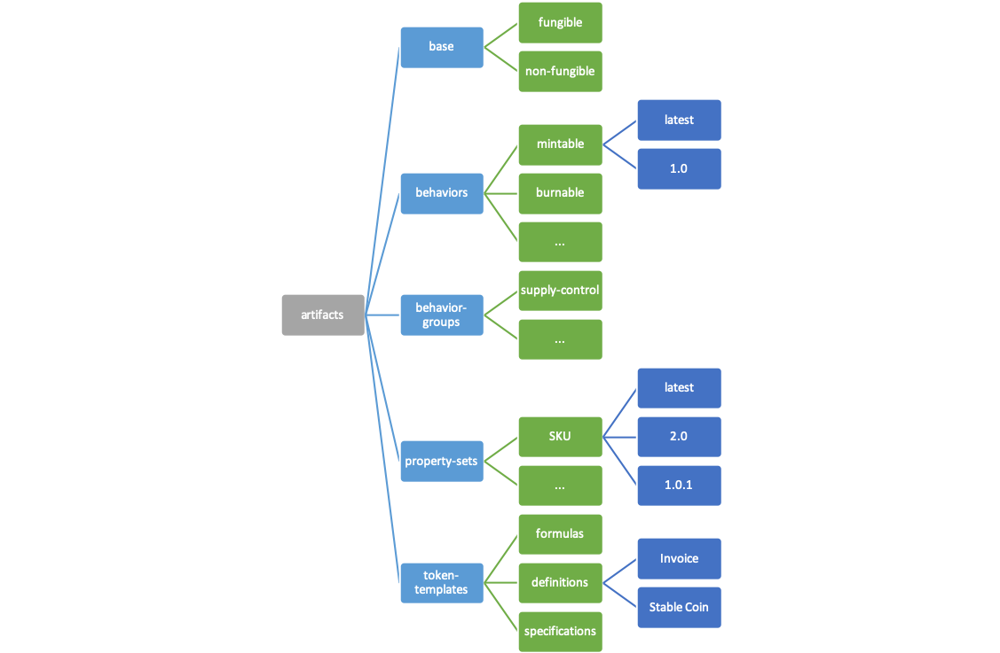

Tools use the Taxonomy Service to retrieve the TOM to update and add artifacts and generate other types assets.

Other GitHub repositories can link to the taxonomy repository to link implementation specific code to specific taxonomy symbols like a behavior or token specification. This code is then mapped as a platform specific implementation of that artifact.

For example, in the Ethereum community [OpenZeppelin](https://github.com/OpenZeppelin/openzeppelin-solidity) there is a popular open source repository for Solidity source code that developers use and is mapped to several artifacts in the TTF.

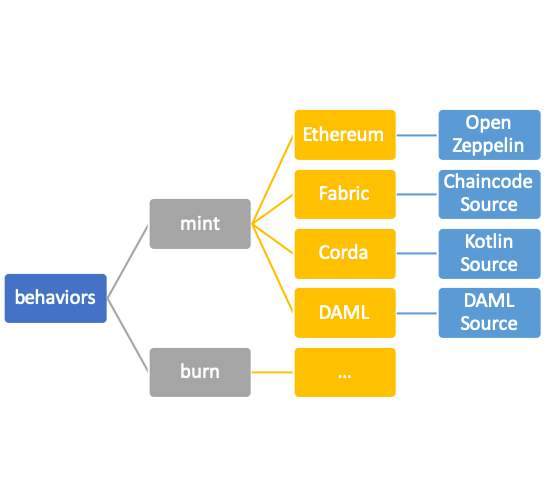

Using a taxonomy code map, tools can be built to generate code for specific platforms by combining the code from the formula into new composite source code to speed development.

Similarly, an implementation map can be used to provide navigation from a specific token formula like **&tau;F{~d,SC}** or `tF{~d,SC}` to map to a vendor or open source complete implementation as open source or a packaged solution.

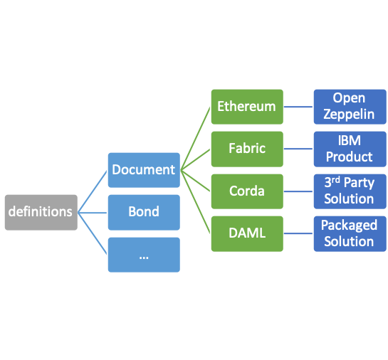

## Design Phases

Using the taxonomy when creating or defining an existing token should improve token implementations. Designs and artifacts are contributed back into the taxonomy making it more useful and providing consistency across implementations. The high-level design phases are:

- Workshop - this is the initial phase when starting from scratch defining the token for your business needs. During this process you reuse and create any new taxonomy artifacts and when complete have a resulting token taxonomy definition and draft specification.
- Reuse - Once you have your taxonomy definition, you may be able to find an existing definition in the taxonomy with the same formula. This doesn't mean that the token you defined is exactly the same as the existing definition, but it’s a good place to start.
- Implementation - You can use maps in the taxonomy to locate platform specific code or complete token solutions from open source, vendors to get create or find an implementation suitable for your deployment platform target. i.e. Ethereum, Hyperledger Fabric, Corda or Digital Asset.

## Logical Interaction Models

Putting all of these taxonomy concepts together allows for interaction models to be modelled so anyone can understand how a completed token works.

- Creating a new Token (class) from a Template - sending a template its constructor message, which will return the new token class's unique identifier.
  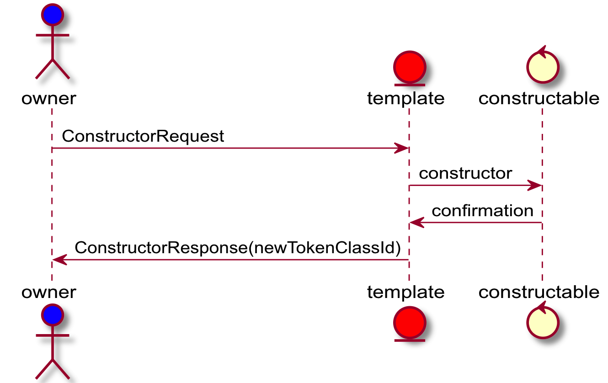

- Interacting with a Token (class) - send a behavior control command message to the token using its unique identifier.
  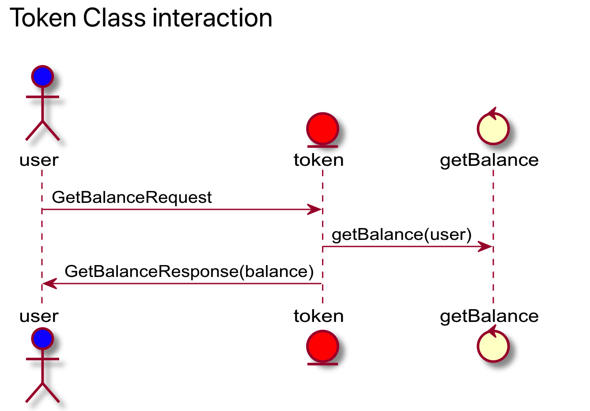

For each complete token definition these interactions can be defined as an artifact file in the artifact folder.

[Interaction Models](logicalIM.md)

## Taxonomy Workshops and Formulas

The taxonomy can be used in a workshop with stakeholders that want to define an existing or figure out a design for a new token. This workshop starts by defining a high-level business and functional purpose for the token and then begin to decompose the existing implementation or if starting from scratch begin composing a taxonomy definition that matches the description.

In the workshop, the group will select a base token type and select from the existing behaviors in the taxonomy like choosing from A la Carte menu at a restaurant. If no suitable behavior or group can be found, the participants should create a new one. Which means they will create a new taxonomy artifact using the TTF.

The end result of the workshop is to have a complete specification for the token that can be expressed using grammar as a formula and its definition. This formula becomes a TTF Branch:

> **&tau;F{~d,SC}**

Using the formula, a template definition is created filling in the details about the token. These two artifacts define a Token Template. Also, from the definition a Token Specification can be generated upon request, which is handy for documentation or business validation.

When a workshops is completed, the artifacts should be recorded, any new behaviors, groups, properties and token templates and a pull request be issued for these to be merged after approval to be part of the framework and available for reuse by other workshops.

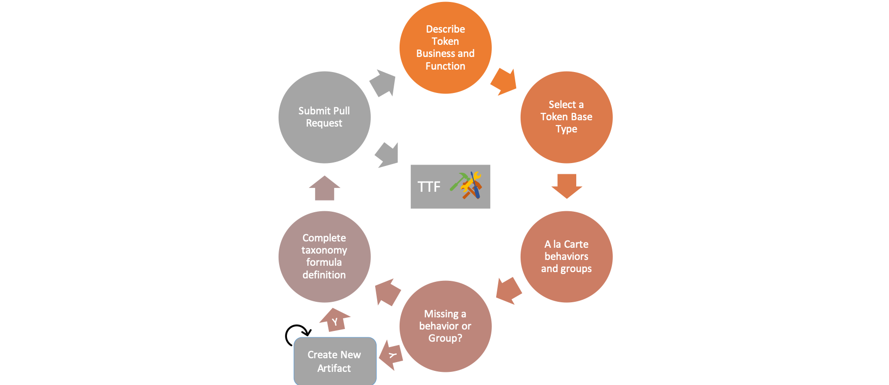

## Benefits of the framework

TTF artifacts are not fixed, nor do they represent complete implementations with specific values until they are applied to a template definition. They do include a common set of behavior and property set invocations as control messages. This is similar to Ethereum's [ERC-20](https://eips.ethereum.org/EIPS/eip-20) interface standard that allows for working with tokens in a generic way and integrate them into common experiences.

Having a common interaction model via generic behavior and property set invocations allows for challenging interoperability issues to be approach from a higher level and being designing systems that allow for contracts to interact with tokens across blockchain implementations using standard control messages defined in a common way.

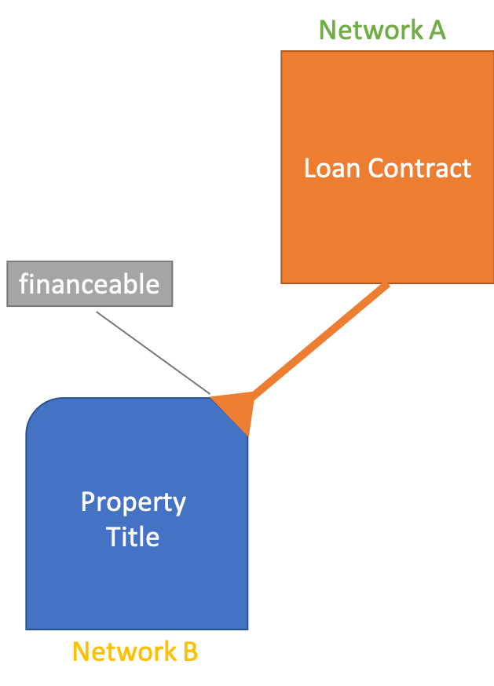

## TTF Extensions

Where does the TTF end and an implementation begin? Artifact Maps described above provide the extensible links to source, implementation and reference materials like legal or regulatory guidance. Using an artifact's `Map` you can reference:

- Complete source code for a platform and language (i.e. HLF/Chaincode/Go - > url)
- A finished solution or implementation (i.e. a link to a website or marketplace offering)
- Regulatory guidance (i.e. link to a regulatory agency report)

This can be done for an individual behavior to have a mapping to a `code snippit` or to a Template Definition for complete source code or reference a finished solution.

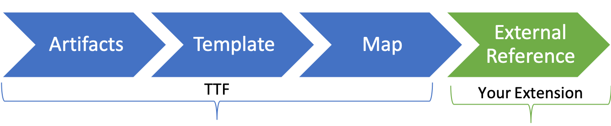

## Conclusion

The Token Taxonomy Framework is just the beginning of a cross platform and cross vertical industry collaborative effort to foster an increased understanding and use of tokens as well as drive standards for interoperability.

The InterWork Alliance (IWA) encourages and will help kick start business working groups for Financial Services, Insurance Healthcare, Energy, Real Estate, Telecommunications and Supply Chain to start defining the tokens most relevant and important for their industry and encourage cross industry integration.
